# TÀI LIỆU HƯỚNG DẪN SỬ DỤNG VÀ VẬN HÀNH HỆ THỐNG QUẢN TRỊ NHÂN LỰC SMARTHRM

> **Phiên bản tài liệu:** 2.0 — Chuẩn hóa toàn diện
> **Phạm vi áp dụng:** Toàn bộ hệ thống bao gồm Giao diện quản trị Web (**HrmAdmin**), Ứng dụng di động (**HrmMobile**) và Hệ thống xử lý trung tâm (**HrmApi**).
> **Ngôn ngữ:** 100% Tiếng Việt chuẩn mực, giải thích chi tiết, không viết tắt, đầy đủ sơ đồ luồng quy trình, bảng mô tả dữ liệu và công thức toán học minh họa thực tế.

---

## MỤC LỤC TỔNG THỂ

1. [Chương 1: Tổng quan hệ thống và Kiến trúc vận hành](#chương-1-tổng-quan-hệ-thống-và-kiến-trúc-vận-hành)
2. [Chương 2: Hướng dẫn cài đặt, Khởi chạy và Chuẩn bị môi trường](#chương-2-hướng-dẫn-cài-đặt-khởi-chạy-và-chuẩn-bị-môi-trường)
3. [Chương 3: Thiết lập Cơ cấu tổ chức doanh nghiệp](#chương-3-thiết-lập-cơ-cấu-tổ-chức-doanh-nghiệp)
4. [Chương 4: Hệ thống Phân quyền vai trò và Phạm vi dữ liệu](#chương-4-hệ-thống-phân-quyền-vai-trò-và-phạm-vi-dữ-liệu)
5. [Chương 5: Quản lý Hồ sơ nhân sự và Vòng đời nhân viên](#chương-5-quản-lý-hồ-sơ-nhân-sự-và-vòng-đời-nhân-viên)
6. [Chương 6: Quản lý Ca làm việc và Lịch phân ca](#chương-6-quản-lý-ca-làm-việc-và-lịch-phân-ca)
7. [Chương 7: Vận hành Chấm công định vị và Xử lý dữ liệu công](#chương-7-vận-hành-chấm-công-định-vị-và-xử-lý-dữ-liệu-công)
8. [Chương 8: Quản lý Làm thêm giờ (Tăng ca) và Chấm công ban đêm](#chương-8-quản-lý-làm-thêm-giờ-tăng-ca-và-chấm-công-ban-đêm)
9. [Chương 9: Quản lý Nghỉ phép, Ngày lễ và Quỹ phép năm](#chương-9-quản-lý-nghỉ-phép-ngày-lễ-và-quỹ-phép-năm)
10. [Chương 10: Tính lương, Thuế thu nhập cá nhân và Bảo hiểm](#chương-10-tính-lương-thuế-thu-nhập-cá-nhân-và-bảo-hiểm)
11. [Chương 11: Toàn bộ Công thức tính toán nghiệp vụ trong hệ thống](#chương-11-toàn-bộ-công-thức-tính-toán-nghiệp-vụ-trong-hệ-thống)
12. [Chương 12: Quản lý Tuyển dụng nhân tài](#chương-12-quản-lý-tuyển-dụng-nhân-tài)
13. [Chương 13: Đánh giá Hiệu suất, Quản trị mục tiêu và Đánh giá 360 độ](#chương-13-đánh-giá-hiệu-suất-quản-trị-mục-tiêu-và-đánh-giá-360-độ)
14. [Chương 14: Đào tạo và Phát triển năng lực nhân sự](#chương-14-đào-tạo-và-phát-triển-năng-lực-nhân-sự)
15. [Chương 15: Quản lý Kỷ luật và Xử lý vi phạm](#chương-15-quản-lý-kỷ-luật-và-xử-lý-vi-phạm)
16. [Chương 16: Quản lý Tài sản và Trang thiết bị cấp phát](#chương-16-quản-lý-tài-sản-và-trang-thiết-bị-cấp-phát)
17. [Chương 17: Quy trình động và Động cơ phê duyệt tự động](#chương-17-quy-trình-động-và-động-cơ-phê-duyệt-tự-động)
18. [Chương 18: Vận hành Ứng dụng di động SmartHRM Mobile](#chương-18-vận-hành-ứng-dụng-di-động-smarthrm-mobile)
19. [Phụ lục: Danh mục mã quyền, Bảng tra cứu lỗi và Hướng dẫn xử lý sự cố](#phụ-lục-danh-mục-mã-quyền-bảng-tra-cứu-lỗi-và-hướng-dẫn-xử-lý-sự-cố)

---

## CHƯƠNG 1: TỔNG QUAN HỆ THỐNG VÀ KIẾN TRÚC VẬN HÀNH

### 1.1 Giới thiệu hệ thống

Hệ thống **SmartHRM** là nền tảng quản trị nguồn nhân lực toàn diện cho doanh nghiệp, được thiết kế theo tiêu chuẩn quản trị hiện đại, linh hoạt cho cả mô hình công ty đơn lẻ (một trụ sở duy nhất) và mô hình tập đoàn đa chi nhánh.

### 1.2 Kiến trúc 3 tầng

Hệ thống bao gồm 3 phân hệ liên kết chặt chẽ:

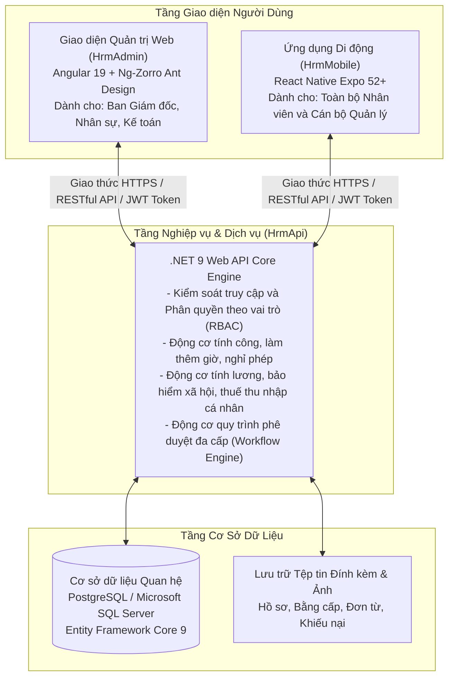

### 1.3 Sơ đồ luồng vận hành tổng thể qua các chu kỳ

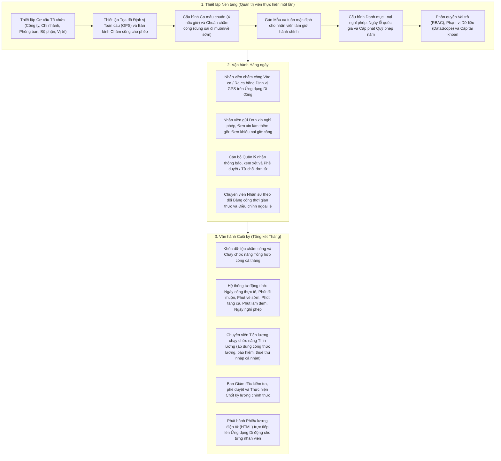

### 1.4 Các nguyên tắc vận hành quan trọng

1. **Tuyệt đối không gán cứng (hard-code) giờ làm việc hoặc số ngày phép trên Ứng dụng Di động:** Toàn bộ thông tin hiển thị trên ứng dụng của nhân viên đều được truy xuất trực tiếp từ máy chủ `HrmApi` theo cấu hình thực tế của doanh nghiệp.
2. **Nguyên tắc không ghi đè dữ liệu gốc của lần bấm giờ:** Dữ liệu thời gian chấm công định vị của nhân viên được lưu lại nguyên bản. Khi có sự điều chỉnh thủ công hoặc duyệt khiếu nại, hệ thống sẽ đánh dấu cờ _Đã điều chỉnh thủ công (IsManualAdjusted = true)_ để phục vụ truy vết và kiểm toán hệ thống.
3. **Mẫu ca tuần mặc định là phương thức cốt lõi:** Nhân viên làm việc toàn thời gian theo giờ hành chính cố định chỉ cần gán một Mẫu ca tuần mặc định (áp dụng từ Thứ Hai đến Thứ Sáu), hệ thống tự động xác định ca làm việc mỗi ngày mà không cần người quản lý phải tạo lịch phân ca thủ công cho từng ngày trong năm.

---

## CHƯƠNG 2: HƯỚNG DẪN CÀI ĐẶT, KHỞI CHẠY VÀ CHUẨN BỊ MÔI TRƯỜNG

### 2.1 Yêu cầu môi trường

- **Máy chủ Backend:** .NET SDK phiên bản 9.0 trở lên.
- **Máy chủ Cơ sở dữ liệu:** PostgreSQL phiên bản 15+ hoặc Microsoft SQL Server 2019+.
- **Môi trường Giao diện Quản trị Web:** Node.js phiên bản 20+ và trình quản lý gói `npm` hoặc `yarn`.
- **Môi trường Ứng dụng Di động:** Node.js 20+, Expo CLI (`npx expo`), ứng dụng Expo Go trên điện thoại thực tế hoặc trình giả lập Android/iOS.

### 2.2 Các câu lệnh khởi chạy hệ thống

#### Bước 1: Khởi chạy Hệ thống Xử lý Trung tâm (HrmApi)

Mở cửa sổ dòng lệnh PowerShell và thực thi:

```powershell
# Di chuyển vào thư mục HrmApi
cd F:\Projects\hrm\HrmApi

# Cập nhật cấu trúc cơ sở dữ liệu lên phiên bản mới nhất
dotnet ef database update --project HrmApi.Infrastructure --startup-project HrmApi.WebApi

# Khởi động dịch vụ Web API
dotnet run --project HrmApi.WebApi
```

_Địa chỉ truy cập mặc định: `https://localhost:7198` hoặc `http://localhost:5248`_

#### Bước 2: Khởi chạy Giao diện Quản trị Web (HrmAdmin)

Mở một cửa sổ dòng lệnh PowerShell mới:

```powershell
# Di chuyển vào thư mục HrmAdmin
cd F:\Projects\hrm\HrmAdmin

# Khởi chạy máy chủ phát triển Angular
npm start
# Hoặc: yarn start
```

_Địa chỉ truy cập mặc định: `http://localhost:4200`_

#### Bước 3: Khởi chạy Ứng dụng Di động (HrmMobile)

Mở một cửa sổ dòng lệnh PowerShell thứ ba:

```powershell
# Di chuyển vào thư mục HrmMobile
cd F:\Projects\hrm\HrmMobile

# Khởi chạy dịch vụ Expo Bundler
npx expo start
```

_Sử dụng điện thoại thông minh mở camera quét mã QR code trên màn hình hoặc nhấn phím `a` để chạy trên máy ảo Android._

### 2.3 Danh sách tài khoản quản trị và nhân viên mẫu

| Tên đăng nhập  | Mật khẩu mặc định | Vai trò trong hệ thống            | Phạm vi quyền hạn                                                 | Giao diện sử dụng                |
| :------------- | :---------------- | :-------------------------------- | :---------------------------------------------------------------- | :------------------------------- |
| `admin`        | `admin123@`       | Quản trị viên hệ thống (ADMIN)    | Toàn quyền cấu hình hệ thống, phân quyền và dữ liệu               | Giao diện Web (HrmAdmin)         |
| `hr_manager`   | `123456`          | Quản lý Nhân sự (HR)              | Toàn quyền nghiệp vụ nhân sự, chấm công, ca kíp, tính lương       | Giao diện Web (HrmAdmin)         |
| `dept_manager` | `123456`          | Trưởng phòng / Quản lý (MANAGER)  | Xem công, duyệt nghỉ phép, duyệt tăng ca cho nhân viên trực thuộc | Giao diện Web & Ứng dụng Di động |
| `employee_01`  | `123456`          | Nhân viên thông thường (EMPLOYEE) | Chấm công GPS, gửi đơn từ, tra cứu phiếu lương cá nhân            | Ứng dụng Di động (HrmMobile)     |

---

## CHƯƠNG 3: THIẾT LẬP CƠ CẤU TỔ CHỨC DOANH NGHIỆP

### 3.1 Hai mô hình cơ cấu tổ chức doanh nghiệp

Hệ thống hỗ trợ song song hai mô hình quản trị tổ chức linh hoạt:

```mermaid
flowchart TD
  subgraph MOHINH_A["Mô hình A: Doanh nghiệp Nhiều Chi Nhánh (Trụ sở chính + Chi nhánh trực thuộc)"]
    A_CO["Công ty (Tổng Công ty)"] --> A_BR["Chi nhánh (Bắt buộc tọa độ GPS riêng)"]
    A_BR --> A_DEP["Phòng ban"]
    A_DEP --> A_PART["Bộ phận (Tổ / Nhóm)"]
    A_PART --> A_POS["Vị trí công việc"]
    A_POS --> A_EMP["Nhân viên"]
  end

  subgraph MOHINH_B["Mô hình B: Doanh nghiệp Độc Lập (Một địa điểm trụ sở duy nhất)"]
    B_CO["Công ty (Chứa tọa độ GPS và Định biên trực tiếp)"] --> B_DEP["Phòng ban (Không gắn Chi nhánh)"]
    B_DEP --> B_PART["Bộ phận (Tổ / Nhóm)"]
    B_PART --> B_POS["Vị trí công việc"]
    B_POS --> B_EMP["Nhân viên"]
  end
```

#### Quy tắc xử lý tọa độ Chấm công Định vị (GPS Geofencing):

1. Nếu nhân viên thuộc một Chi nhánh và Chi nhánh đó đã thiết lập tọa độ hợp lệ: Hệ thống sử dụng **Tọa độ của Chi nhánh**.
2. Nếu nhân viên làm việc tại doanh nghiệp độc lập (không có chi nhánh) hoặc Chi nhánh chưa có tọa độ: Hệ thống tự động chuyển sang sử dụng **Tọa độ của Trụ sở Công ty**.
3. Nếu cả Chi nhánh và Công ty đều chưa cấu hình tọa độ: Hệ thống sẽ từ chối lượt chấm công và thông báo lỗi cấu hình địa điểm.

### 3.2 Bảng chi tiết các trường thông tin trong Cơ cấu tổ chức

#### 1. Thông tin Doanh nghiệp / Công ty (Company)

Đường dẫn trên giao diện: **Tổ chức → Công ty** (`/organization/company`)

| Tên trường dữ liệu     | Ý nghĩa nghiệp vụ                                   | Tên trường hệ thống (API) |         Bắt buộc         | Kiểu dữ liệu             | Quy tắc kiểm tra (Validation)                                             |
| :--------------------- | :-------------------------------------------------- | :------------------------ | :----------------------: | :----------------------- | :------------------------------------------------------------------------ |
| **Mã công ty**         | Mã định danh duy nhất của doanh nghiệp              | `Code`                    |          **Có**          | Chuỗi ký tự (Tối đa 50)  | Viết hoa, không dấu, không trùng lặp (ví dụ:`SMART_HRM`)                  |
| **Tên công ty**        | Tên đầy đủ của doanh nghiệp theo đăng ký kinh doanh | `Name`                    |          **Có**          | Chuỗi ký tự (Tối đa 250) | Không được để trống                                                       |
| **Tên viết tắt**       | Tên giao dịch ngắn gọn                              | `ShortName`               |          Không           | Chuỗi ký tự (Tối đa 50)  | Hiển thị trên thanh tiêu đề và hóa đơn                                    |
| **Mã số thuế**         | Mã số thuế doanh nghiệp                             | `TaxCode`                 |          Không           | Chuỗi ký tự (Tối đa 20)  | Định dạng mã số thuế hợp lệ                                               |
| **Địa chỉ trụ sở**     | Địa chỉ văn phòng chính                             | `Address`                 |          Không           | Chuỗi ký tự (Tối đa 500) | Địa chỉ hiển thị trên báo cáo                                             |
| **Vĩ độ GPS**          | Tọa độ vĩ độ của trụ sở chính                       | `Latitude`                | **Có** _(với Mô hình B)_ | Số thực (Double)         | Giá trị từ`-90.0` đến `+90.0` (ví dụ: `21.028511`)                        |
| **Kinh độ GPS**        | Tọa độ kinh độ của trụ sở chính                     | `Longitude`               | **Có** _(với Mô hình B)_ | Số thực (Double)         | Giá trị từ`-180.0` đến `+180.0` (ví dụ: `105.854444`)                     |
| **Định biên tối đa**   | Số lượng nhân sự tối đa toàn công ty                | `MaxEmployeeCapacity`     |          Không           | Số nguyên dương          | Mô hình A tự động tính tổng từ các Chi nhánh                              |
| **Chính sách Thứ Bảy** | Quy định làm việc vào ngày Thứ Bảy hàng tuần        | `SaturdayPolicy`          |          **Có**          | Danh mục lựa chọn        | `OFF` (Nghỉ cả ngày), `HALF_DAY` (Làm nửa ngày), `FULL_DAY` (Làm cả ngày) |

#### 2. Thông tin Chi nhánh (Branch)

Đường dẫn trên giao diện: **Tổ chức → Chi nhánh** (`/organization/branch`)

| Tên trường dữ liệu      | Ý nghĩa nghiệp vụ                                       | Tên trường hệ thống (API) | Bắt buộc | Kiểu dữ liệu             | Quy tắc kiểm tra (Validation)                     |
| :---------------------- | :------------------------------------------------------ | :------------------------ | :------: | :----------------------- | :------------------------------------------------ |
| **Mã chi nhánh**        | Mã định danh duy nhất của chi nhánh                     | `Code`                    |  **Có**  | Chuỗi ký tự (Tối đa 50)  | Không trùng lặp trong cùng công ty                |
| **Tên chi nhánh**       | Tên văn phòng chi nhánh                                 | `Name`                    |  **Có**  | Chuỗi ký tự (Tối đa 250) | Ví dụ:_Chi nhánh Hà Nội, Chi nhánh Đà Nẵng_       |
| **Thuộc công ty**       | Công ty chủ quản                                        | `CompanyId`               |  **Có**  | Mã định danh (GUID)      | Chọn từ danh mục công ty                          |
| **Vĩ độ GPS**           | Tọa độ vĩ độ thực tế của văn phòng chi nhánh            | `Latitude`                |  **Có**  | Số thực (Double)         | Bắt buộc để nhân viên chi nhánh chấm công định vị |
| **Kinh độ GPS**         | Tọa độ kinh độ thực tế của văn phòng chi nhánh          | `Longitude`               |  **Có**  | Số thực (Double)         | Bắt buộc để nhân viên chi nhánh chấm công định vị |
| **Định biên chi nhánh** | Hạn ngạch nhân sự tối đa của chi nhánh                  | `MaxEmployeeCapacity`     |  Không   | Số nguyên dương          | Dùng để cảnh báo khi tuyển dụng vượt định biên    |
| **Giám đốc chi nhánh**  | Người đứng đầu chịu trách nhiệm phê duyệt cấp chi nhánh | `ManagerId`               |  Không   | Mã định danh (GUID)      | Chọn từ danh sách nhân viên của chi nhánh         |

#### 3. Thông tin Phòng ban (Department) và Bộ phận (Part)

Đường dẫn trên giao diện: **Tổ chức → Phòng ban** (`/organization/department`) và **Tổ chức → Bộ phận** (`/organization/part`)

| Tên trường dữ liệu           | Ý nghĩa nghiệp vụ                       | Tên trường hệ thống (API) |        Bắt buộc        | Kiểu dữ liệu             | Quy tắc kiểm tra (Validation)                   |
| :--------------------------- | :-------------------------------------- | :------------------------ | :--------------------: | :----------------------- | :---------------------------------------------- |
| **Mã phòng / Bộ phận**       | Mã định danh phòng ban hoặc tổ nhóm     | `Code`                    |         **Có**         | Chuỗi ký tự (Tối đa 50)  | Ví dụ:`PHONG_IT`, `TO_DEV_01`                   |
| **Tên phòng / Bộ phận**      | Tên gọi phòng ban hoặc tổ nhóm          | `Name`                    |         **Có**         | Chuỗi ký tự (Tối đa 250) | Ví dụ:_Phòng Công nghệ Thông tin_               |
| **Chi nhánh trực thuộc**     | Chi nhánh quản lý phòng ban             | `BranchId`                |         Không          | Mã định danh (GUID)      | Để trống đối với công ty độc lập một địa điểm   |
| **Trưởng phòng / Tổ trưởng** | Cán bộ quản lý trực tiếp                | `ManagerId`               | **Có** _(Khuyến nghị)_ | Mã định danh (GUID)      | Người nhận thông báo và phê duyệt đơn nghỉ phép |
| **Phó phòng / Tổ phó**       | Cán bộ quản lý phó phụ trách duyệt thay | `DeputyManagerId`         |         Không          | Mã định danh (GUID)      | Phê duyệt khi người quản lý chính vắng mặt      |
| **Định biên phòng ban**      | Số lượng nhân sự tối đa của phòng ban   | `Limit`                   |         Không          | Số nguyên dương          | Kiểm soát tuyển dụng và chuyển công tác         |

### 3.3 Sơ đồ tổ chức dạng cây động (Org Chart)

Đường dẫn trên giao diện: **Tổ chức → Sơ đồ tổ chức** (`/organization/org-chart`)

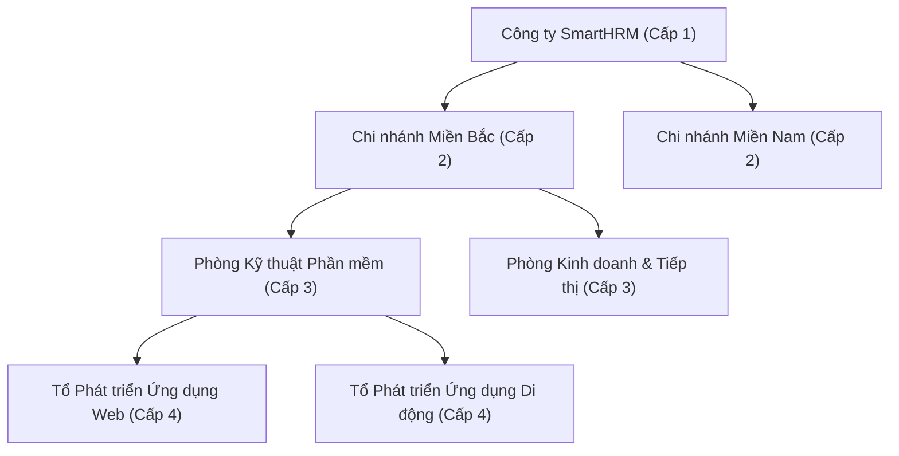

- **Thao tác kéo thả phân cấp (Drag & Drop):** Người dùng có quyền `ORGANIZATION_MANAGE` có thể kéo thả các nút phòng ban hoặc bộ phận để thay đổi cấp trên trực tiếp.
- **Cơ chế phòng ngừa lỗi logic:** Hệ thống tự động kiểm tra và ngăn chặn các hành động kéo thả gây ra lỗi vòng lặp cha-con (ví dụ: không thể kéo phòng ban cha trở thành con của chính bộ phận cấp dưới của nó).

---

## CHƯƠNG 4: HỆ THỐNG PHÂN QUYỀN VAI TRÒ VÀ PHẠM VI DỮ LIỆU

### 4.1 Mô hình Phân quyền Vai trò (RBAC) và Phạm vi Dữ liệu (DataScope)

Hệ thống bảo mật dữ liệu theo cơ chế kiểm soát truy cập dựa trên vai trò kết hợp phạm vi truy xuất dữ liệu:

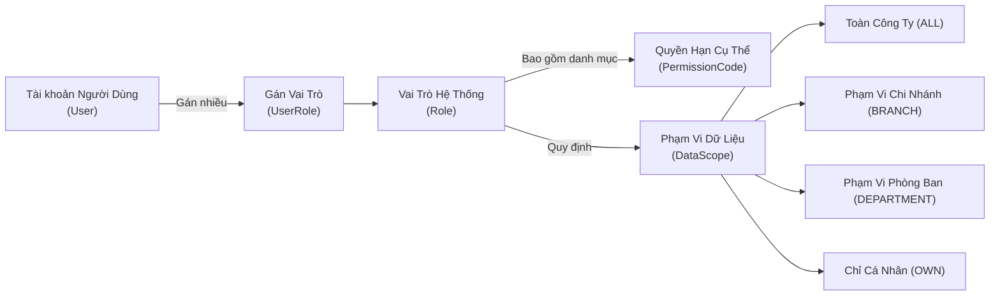

### 4.2 Chi tiết 4 Cấp độ Phạm vi Dữ liệu (DataScope)

1. **Toàn bộ Công ty (`ALL`):**
   - Người dùng có thể xem và xử lý dữ liệu của tất cả các chi nhánh, phòng ban và nhân viên trong toàn doanh nghiệp.
   - Thường áp dụng cho: _Ban Tổng Giám đốc, Giám đốc Nhân sự, Kế toán trưởng, Quản trị viên hệ thống_.
2. **Phạm vi Chi nhánh (`BRANCH`):**
   - Người dùng chỉ xem và quản lý dữ liệu thuộc chi nhánh mà mình được chỉ định công tác.
   - Thường áp dụng cho: _Giám đốc Chi nhánh, Trưởng phòng Nhân sự chi nhánh_.
3. **Phạm vi Phòng ban (`DEPARTMENT`):**
   - Người dùng chỉ truy cập được dữ liệu của phòng ban mình phụ trách và các bộ phận/tổ nhóm trực thuộc bên dưới.
   - Thường áp dụng cho: _Trưởng phòng, Phó phòng ban_.
4. **Phạm vi Cá nhân (`OWN`):**
   - Người dùng chỉ có quyền xem dữ liệu cá nhân của chính mình (chấm công, phiếu lương, đơn từ cá nhân).
   - Thường áp dụng cho: _Nhân viên thông thường_.

### 4.3 Bảng phân quyền mặc định của 4 Vai trò nòng cốt

| Nhóm nghiệp vụ                  | Quản trị viên (ADMIN) |  Quản lý Nhân sự (HR)  |    Cán bộ Quản lý (MANAGER)     |       Nhân viên (EMPLOYEE)       |
| :------------------------------ | :-------------------: | :--------------------: | :-----------------------------: | :------------------------------: |
| **Cấu hình Cơ cấu Tổ chức**     |   Toàn quyền (ALL)    |     Chỉ xem (ALL)      |        Chỉ xem (BRANCH)         |          Không có quyền          |
| **Quản lý Hồ sơ Nhân sự**       |   Toàn quyền (ALL)    |    Toàn quyền (ALL)    |    Xem nhân viên trực thuộc     |      Xem thông tin cá nhân       |
| **Cấu hình Ca & Lịch làm việc** |   Toàn quyền (ALL)    |    Toàn quyền (ALL)    |       Xem lịch phòng ban        |         Xem lịch cá nhân         |
| **Quản lý Bảng chấm công**      |   Toàn quyền (ALL)    | Toàn quyền điều chỉnh  |      Xem bảng công đội ngũ      | Chấm công GPS & Xem công cá nhân |
| **Xử lý Khiếu nại Chấm công**   |    Phê duyệt (ALL)    |    Phê duyệt (ALL)     |         Xem xét đề xuất         |      Gửi khiếu nại kèm ảnh       |
| **Phê duyệt Đơn xin Nghỉ phép** |   Phê duyệt cấp cao   | Phê duyệt / Điều chỉnh | Phê duyệt cấp quản lý trực tiếp |   Tạo đơn & Hủy đơn chờ duyệt    |
| **Phê duyệt Đơn làm Tăng ca**   |   Phê duyệt cấp cao   | Phê duyệt / Điều chỉnh | Phê duyệt cấp quản lý trực tiếp |         Tạo đơn tăng ca          |
| **Tính lương & Chốt kỳ lương**  |   Toàn quyền (ALL)    |  Thực hiện tính lương  |         Không có quyền          |     Xem phiếu lương cá nhân      |
| **Phân quyền & Tạo tài khoản**  |   Toàn quyền (ALL)    | Xem danh sách vai trò  |         Không có quyền          |          Không có quyền          |
| **Truy cập Ứng dụng Di động**   |   Đầy đủ tính năng    |    Đầy đủ tính năng    |     Có (Tính năng Quản lý)      |     Có (Tính năng Nhân viên)     |

---

## CHƯƠNG 5: QUẢN LÝ HỒ SƠ NHÂN SỰ VÀ VÒNG ĐỜI NHÂN VIÊN

### 5.1 Sơ đồ quản lý toàn diện hồ sơ nhân viên

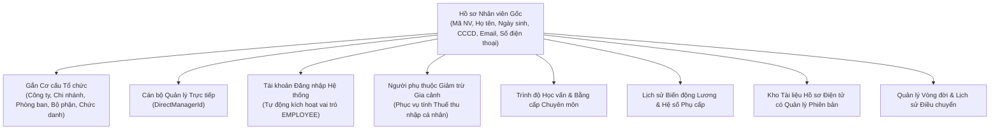

### 5.2 Bảng chi tiết các trường thông tin trong Hồ sơ Nhân viên

Đường dẫn trên giao diện: **Nhân sự → Nhân viên** (`/human-resource/employee`)

| Tên trường hiển thị         | Ý nghĩa nghiệp vụ                               | Tên trường API    | Bắt buộc | Kiểu dữ liệu             | Ghi chú & Ràng buộc                                            |
| :-------------------------- | :---------------------------------------------- | :---------------- | :------: | :----------------------- | :------------------------------------------------------------- |
| **Mã nhân viên**            | Mã định danh duy nhất của nhân viên             | `Code`            |  **Có**  | Chuỗi ký tự (Tối đa 50)  | Tự động sinh hoặc nhập tay, không trùng lặp (ví dụ:`NV-00102`) |
| **Họ và tên đệm**           | Họ và tên đệm của nhân viên                     | `FirstName`       |  **Có**  | Chuỗi ký tự (Tối đa 100) | Ví dụ:_Nguyễn Văn_                                             |
| **Tên**                     | Tên chính của nhân viên                         | `LastName`        |  **Có**  | Chuỗi ký tự (Tối đa 50)  | Ví dụ:_An_                                                     |
| **Số Căn cước công dân**    | Số định danh cá nhân / Hộ chiếu                 | `IdentityNumber`  |  **Có**  | Chuỗi ký tự (Tối đa 20)  | 12 chữ số theo quy định pháp luật Việt Nam                     |
| **Địa chỉ Email công việc** | Email dùng để nhận thông báo và đăng nhập       | `Email`           |  **Có**  | Chuỗi ký tự (Email)      | Định dạng email hợp lệ, không trùng lặp trong hệ thống         |
| **Số điện thoại**           | Số điện thoại liên lạc di động                  | `PhoneNumber`     |  **Có**  | Chuỗi ký tự (Tối đa 20)  | 10 chữ số                                                      |
| **Giới tính**               | Giới tính của nhân viên                         | `Gender`          |  **Có**  | Lựa chọn                 | `MALE` (Nam), `FEMALE` (Nữ), `OTHER` (Khác)                    |
| **Ngày sinh**               | Ngày tháng năm sinh                             | `BirthDate`       |  **Có**  | Ngày tháng (Date)        | Nhân viên phải từ đủ 18 tuổi trở lên                           |
| **Công ty chủ quản**        | Công ty ký hợp đồng lao động                    | `CompanyId`       |  **Có**  | Mã định danh (GUID)      | Chọn từ danh mục công ty                                       |
| **Phòng ban**               | Phòng ban công tác                              | `DepartmentId`    |  **Có**  | Mã định danh (GUID)      | Chọn từ danh mục phòng ban                                     |
| **Vị trí công việc**        | Chức danh chuyên môn đảm nhiệm                  | `PositionId`      |  **Có**  | Mã định danh (GUID)      | Chọn từ danh mục vị trí                                        |
| **Quản lý trực tiếp**       | Cán bộ quản lý phụ trách giao việc và duyệt đơn | `DirectManagerId` |  Không   | Mã định danh (GUID)      | Chọn từ danh sách nhân viên quản lý                            |
| **Ngày bắt đầu làm việc**   | Ngày chính thức vào làm tại doanh nghiệp        | `JoinDate`        |  **Có**  | Ngày tháng (Date)        | Căn cứ tính thâm niên công tác và thâm niên phép               |
| **Trạng thái làm việc**     | Trạng thái hiện tại trong vòng đời nhân sự      | `Status`          |  **Có**  | Danh mục trạng thái      | Xem chi tiết bảng chuyển đổi trạng thái bên dưới               |

### 5.3 Bảng chuyển đổi trạng thái Vòng đời Nhân sự (Lifecycle Status)

| Mã trạng thái | Tên tiếng Việt hiển thị | Ý nghĩa nghiệp vụ                                                          | Ràng buộc chấm công & Tính lương                                         |
| :------------ | :---------------------- | :------------------------------------------------------------------------- | :----------------------------------------------------------------------- |
| `PROBATION`   | **Thử việc**            | Nhân viên đang trong giai đoạn thử việc (thường hưởng 85% lương cơ bản)    | Chấm công bình thường, hợp đồng loại thử việc                            |
| `WORKING`     | **Đang làm việc**       | Nhân viên chính thức đang thực hiện hợp đồng lao động                      | Đầy đủ quyền lợi chấm công, nghỉ phép và đóng bảo hiểm                   |
| `OFFICIAL`    | **Chính thức**          | Đã ký hợp đồng lao động xác định hoặc không xác định thời hạn              | Hưởng 100% lương và chế độ phúc lợi đầy đủ                               |
| `ON_LEAVE`    | **Nghỉ tạm hoãn**       | Tạm hoãn hợp đồng lao động (nghỉ thai sản, điều trị bệnh dài ngày, du học) | Không tính chỉ tiêu công tháng, tạm dừng đóng bảo hiểm                   |
| `SUSPENDED`   | **Đình chỉ công tác**   | Tạm đình chỉ để phục vụ công tác điều tra xử lý kỷ luật                    | Tạm dừng quyền đăng nhập hệ thống và chấm công                           |
| `RESIGNED`    | **Nghỉ việc**           | Đã hoàn tất thủ tục thanh lý hợp đồng và chấm dứt làm việc                 | Khóa tài khoản đăng nhập, chốt sổ bảo hiểm và thanh toán lương cuối cùng |
| `RETIRED`     | **Nghỉ hưu**            | Đã đủ tuổi nghỉ hưu theo quy định của pháp luật                            | Hoàn tất chế độ hưu trí                                                  |

---

## CHƯƠNG 6: QUẢN LÝ CA LÀM VIỆC VÀ LỊCH PHÂN CA

### 6.1 Kiến trúc 3 Tầng quản lý thời gian làm việc

Hệ thống SmartHRM quản lý thời gian làm việc thông minh thông qua 3 tầng cấu hình độc lập:

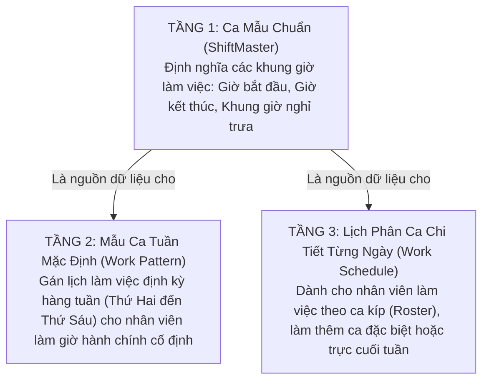

### 6.2 Thứ tự ưu tiên xác định Ca làm việc hợp lệ khi Chấm công

Khi nhân viên thực hiện thao tác Chấm công trên Ứng dụng Di động, hệ thống tự động xác định ca làm việc theo thứ tự ưu tiên sau:

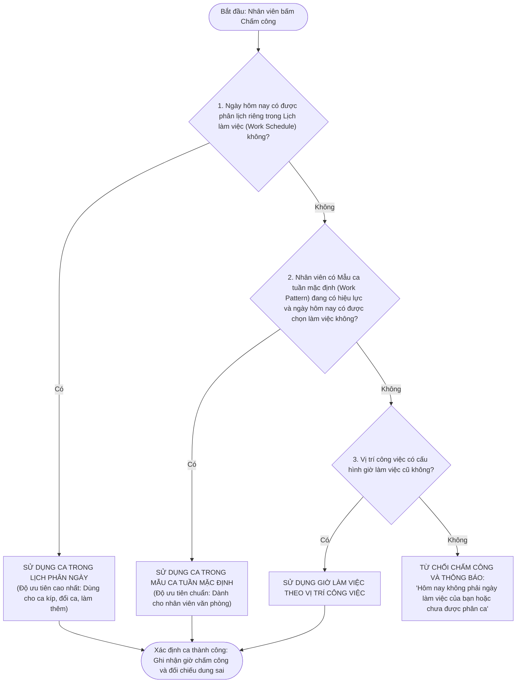

### 6.3 Bảng giải thích chi tiết 4 Mốc thời gian của Ca mẫu (ShiftMaster)

Đường dẫn trên giao diện: **Vận hành → Ca / Lịch → Tab Ca làm việc** (`/operate-manager/time-attendance/shift?tab=shift`)

| Tên mốc thời gian                 | Tên trường API   | Ví dụ chuẩn | Ý nghĩa nghiệp vụ & Quy tắc tính toán                                                                                                            |
| :-------------------------------- | :--------------- | :---------: | :----------------------------------------------------------------------------------------------------------------------------------------------- |
| **Giờ bắt đầu làm việc**          | `StartTime`      |   `08:00`   | Mốc thời gian bắt đầu tính giờ làm việc. Nhân viên chấm công vào sau mốc này (cộng thêm số phút ân hạn) sẽ bị tính là**Đi muộn**.                |
| **Giờ kết thúc làm việc**         | `EndTime`        |   `17:00`   | Mốc thời gian kết thúc ca làm việc chuẩn. Nhân viên chấm công ra trước mốc này (trừ đi số phút ân hạn) sẽ bị tính là**Về sớm**.                  |
| **Bắt đầu nghỉ trưa**             | `BreakStartTime` |   `12:00`   | Mốc bắt đầu thời gian nghỉ giữa ca. Thời gian nhân viên làm việc trùng vào khung giờ nghỉ trưa sẽ tự động bị khấu trừ khi tính giờ công thực tế. |
| **Kết thúc nghỉ trưa**            | `BreakEndTime`   |   `13:00`   | Mốc kết thúc thời gian nghỉ giữa ca.                                                                                                             |
| **Tổng số phút nghỉ giữa ca**     | `BreakMinutes`   |  `60` phút  | Tự động tính:`(BreakEndTime − BreakStartTime)`.                                                                                                  |
| **Số phút công chuẩn trong ngày** | `WorkingMinutes` | `480` phút  | Tự động tính:`(EndTime − StartTime − BreakMinutes)` = 9 tiếng − 1 tiếng = 8 tiếng = 480 phút = 1.0 ngày công chuẩn.                              |

---

## CHƯƠNG 7: VẬN HÀNH CHẤM CÔNG ĐỊNH VỊ VÀ XỬ LÝ DỮ LIỆU CÔNG

### 7.1 Quy trình Chấm công Định vị GPS trên Ứng dụng Di động

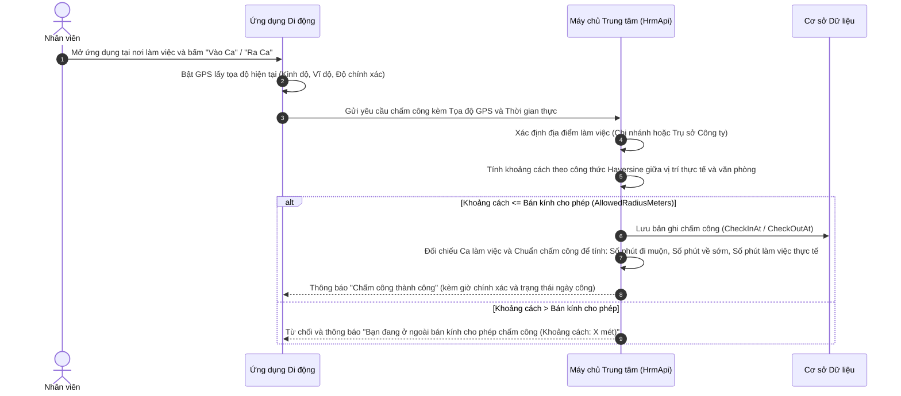

### 7.2 Bảng phân loại 6 Trạng thái Ngày công

Hệ thống tự động đánh giá và gắn nhãn trạng thái cho từng ngày làm việc của nhân viên:

| Mã trạng thái | Tên tiếng Việt hiển thị | Màu sắc nhận diện | Điều kiện xác định trạng thái                                                                                            |
| :------------ | :---------------------- | :---------------: | :----------------------------------------------------------------------------------------------------------------------- |
| `ON_TIME`     | **Đúng giờ**            |    Xanh lá cây    | Có đầy đủ lượt chấm Vào và Ra; thời gian vào không muộn hơn dung sai cho phép và thời gian ra không sớm hơn ca quy định. |
| `LATE`        | **Đi muộn**             |      Màu cam      | Chấm công vào sau giờ bắt đầu ca quy chuẩn cộng với số phút ân hạn cho phép (`LateGraceMinutes`).                        |
| `EARLY`       | **Về sớm**              |     Màu vàng      | Chấm công ra trước giờ kết thúc ca quy chuẩn trừ đi số phút ân hạn cho phép (`EarlyLeaveGraceMinutes`).                  |
| `LEAVE`       | **Nghỉ phép**           |      Màu tím      | Nhân viên có đơn xin nghỉ phép đã được cấp quản lý hoặc nhân sự phê duyệt chính thức (`APPROVED`).                       |
| `ABSENT`      | **Vắng mặt**            |      Màu đỏ       | Ngày làm việc theo lịch nhưng nhân viên không có bất kỳ lượt chấm công nào và không có đơn xin nghỉ phép hợp lệ.         |
| `INCOMPLETE`  | **Chưa hoàn thành**     |   Xanh da trời    | Nhân viên mới chỉ chấm công Vào ca nhưng chưa chấm công Ra ca khi hết ngày.                                              |

### 7.3 Quy trình Xử lý Khiếu nại Chấm công (Attendance Complaint)

Khi nhân viên có mặt làm việc đúng giờ nhưng quên quẹt thẻ, máy điện thoại hết pin hoặc hệ thống ghi nhận sai giờ, nhân viên thực hiện gửi đơn Khiếu nại chấm công:

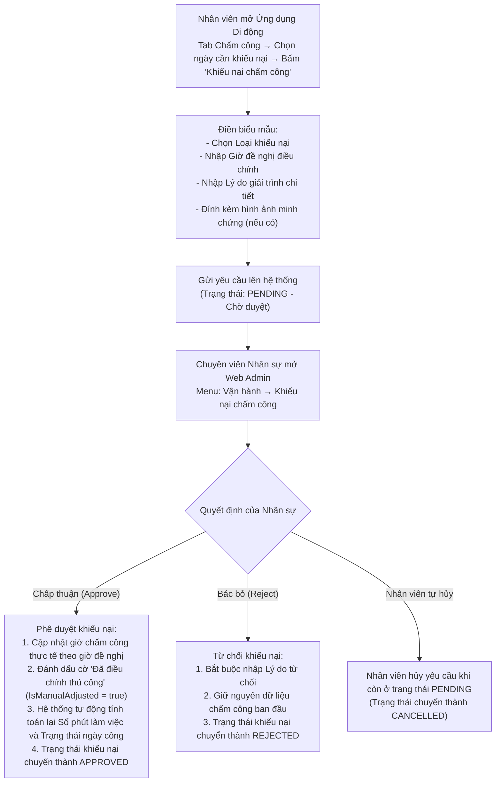

#### Bảng chi tiết 5 Loại Khiếu nại Chấm công

| Mã loại khiếu nại  | Tên tiếng Việt hiển thị     | Ý nghĩa nghiệp vụ                                                  | Các trường thời gian bắt buộc nhập                            |
| :----------------- | :-------------------------- | :----------------------------------------------------------------- | :------------------------------------------------------------ |
| `FORGOT_CHECK_IN`  | **Quên chấm công vào**      | Nhân viên có mặt làm việc đúng giờ nhưng quên bấm vào ca           | Giờ vào ca đề nghị (`ProposedCheckIn`)                        |
| `FORGOT_CHECK_OUT` | **Quên chấm công ra**       | Nhân viên làm việc đến hết ca nhưng khi về quên bấm ra ca          | Giờ ra ca đề nghị (`ProposedCheckOut`)                        |
| `FORGOT_BOTH`      | **Quên cả vào và ra**       | Có đi làm nhưng quên toàn bộ lượt bấm chấm công trong ngày         | Cả Giờ vào (`ProposedCheckIn`) và Giờ ra (`ProposedCheckOut`) |
| `WRONG_TIME`       | **Giờ ghi nhận không đúng** | Hệ thống ghi nhận sai lệch giờ do sự cố mạng hoặc định vị          | Cả Giờ vào và Giờ ra đề nghị điều chỉnh lại                   |
| `OTHER`            | **Lý do khác**              | Các trường hợp đặc thù khác (công tác đột xuất, đi gặp khách hàng) | Ít nhất một trong hai mốc giờ kèm văn bản giải trình          |

---

## CHƯƠNG 8: QUẢN LÝ LÀM THÊM GIỜ (TĂNG CA) VÀ CHẤM CÔNG BAN ĐÊM

### 8.1 Quy trình Đăng ký và Phê duyệt Tăng ca (Overtime - OT)

Đường dẫn trên giao diện: **Vận hành → Chấm công → Đơn tăng ca** (`/operate-manager/time-attendance/overtime-request`)

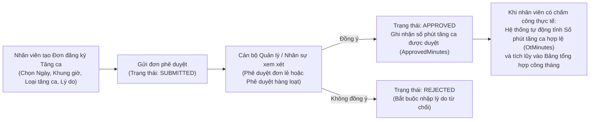

### 8.2 Bảng phân loại 3 Loại Tăng ca

| Mã loại tăng ca | Tên tiếng Việt hiển thị          | Ý nghĩa nghiệp vụ                                                    |                   Hệ số tính lương theo Luật Lao động                   |
| :-------------- | :------------------------------- | :------------------------------------------------------------------- | :---------------------------------------------------------------------: |
| `AFTER_SHIFT`   | **Tăng ca ngày làm việc thường** | Làm thêm giờ ngay sau khi kết thúc ca làm việc tiêu chuẩn hàng ngày  |            **150%** (Gấp 1.5 lần mức lương giờ bình thường)             |
| `DAY_OFF`       | **Tăng ca ngày nghỉ hàng tuần**  | Làm thêm giờ vào ngày nghỉ định kỳ hàng tuần (Thứ Bảy hoặc Chủ Nhật) |            **200%** (Gấp 2.0 lần mức lương giờ bình thường)             |
| `HOLIDAY`       | **Tăng ca ngày Lễ, Tết**         | Làm thêm giờ vào các ngày nghỉ lễ quốc gia được hưởng nguyên lương   | **300%** (Gấp 3.0 lần mức lương giờ bình thường, chưa kể lương ngày lễ) |

### 8.3 Quy định về Chấm công và Làm việc Ban đêm

- **Khung giờ làm việc ban đêm quy chuẩn:** Theo quy định của pháp luật Việt Nam, khung giờ làm việc ban đêm được tính từ **22:00 đêm hôm trước đến 06:00 sáng hôm sau**.
- **Cách tính Số phút làm việc ban đêm (`NightMinutes`):** Hệ thống tự động tính toán phần giao giữa khoảng thời gian chấm công thực tế của nhân viên với khung giờ 22:00–06:00.
- **Phụ cấp làm việc ban đêm:** Nhân viên làm việc vào ban đêm được trả thêm ít nhất **30%** tiền lương tính theo đơn giá tiền lương hoặc tiền lương thực trả của công việc đang làm vào ban ngày.

---

## CHƯƠNG 9: QUẢN LÝ NGHỈ PHÉP, NGÀY LỄ VÀ QUỸ PHÉP NĂM

### 9.1 Sơ đồ Chu trình Quản lý và Trừ Quỹ Phép Năm

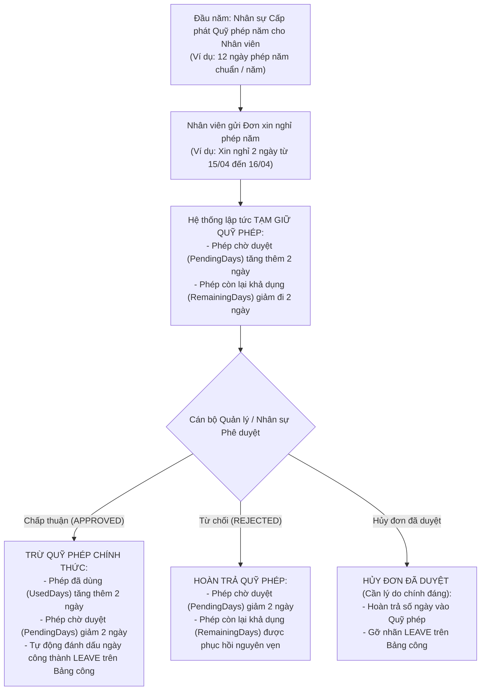

### 9.2 Bảng cấu hình các Loại Nghỉ phép (DayOffConfig)

Đường dẫn trên giao diện: **Vận hành → Nghỉ phép → Cấu hình nghỉ** (`/operate-manager/time-attendance/day-off-config`)

| Mã loại nghỉ | Tên loại nghỉ phép         | Loại nghiệp vụ (`Type`) | Có trừ quỹ phép (`DeductBalance`) |        Bắt buộc đính kèm tệp         | Số ngày tối đa mỗi đơn | Chế độ hưởng lương            |
| :----------- | :------------------------- | :---------------------- | :-------------------------------: | :----------------------------------: | :--------------------: | :---------------------------- |
| `ANNUAL`     | **Nghỉ phép năm**          | Phép năm                |              **Có**               |                Không                 |  Theo số dư quỹ phép   | Hưởng 100% lương              |
| `SICK`       | **Nghỉ ốm đau**            | Nghỉ ốm                 |               Không               |      **Có** _(Giấy khám/viện)_       |        30 ngày         | Hưởng trợ cấp Bảo hiểm xã hội |
| `MATERNITY`  | **Nghỉ thai sản**          | Thai sản                |               Không               | **Có** _(Giấy khai sinh/chứng sinh)_ |   180 ngày (6 tháng)   | Hưởng trợ cấp Bảo hiểm xã hội |
| `MARRIAGE`   | **Nghỉ kết hôn**           | Việc riêng có lương     |               Không               |                Không                 |        03 ngày         | Hưởng 100% lương theo Luật    |
| `FUNERAL`    | **Nghỉ tang lễ**           | Việc riêng có lương     |               Không               |                Không                 |        03 ngày         | Hưởng 100% lương theo Luật    |
| `UNPAID`     | **Nghỉ không hưởng lương** | Nghỉ không lương        |               Không               |                Không                 |     Theo phê duyệt     | Không hưởng lương             |

### 9.3 Quy định về Buổi nghỉ (Nửa ngày / Cả ngày)

| Mã buổi nghỉ (`Session`) | Tên tiếng Việt hiển thị |     Số ngày công quy đổi     | Quy tắc kiểm tra ngày tháng                                                 |
| :----------------------- | :---------------------- | :--------------------------: | :-------------------------------------------------------------------------- |
| `FULL`                   | **Cả ngày**             | **1.0** ngày / ngày làm việc | Ngày bắt đầu (`FromDate`) có thể khác hoặc bằng Ngày kết thúc (`ToDate`)    |
| `AM`                     | **Buổi sáng**           |      **0.5** ngày công       | Ngày bắt đầu**bắt buộc phải trùng** với Ngày kết thúc (`FromDate = ToDate`) |
| `PM`                     | **Buổi chiều**          |      **0.5** ngày công       | Ngày bắt đầu**bắt buộc phải trùng** với Ngày kết thúc (`FromDate = ToDate`) |

---

## CHƯƠNG 10: TÍNH LƯƠNG, THUẾ THU NHẬP CÁ NHÂN VÀ BẢO HIỂM

### 10.1 Quy trình Chốt kỳ lương 6 Bước khép kín

Đường dẫn trên giao diện: **Tiền lương → Bảng lương** (`/payroll/run`)

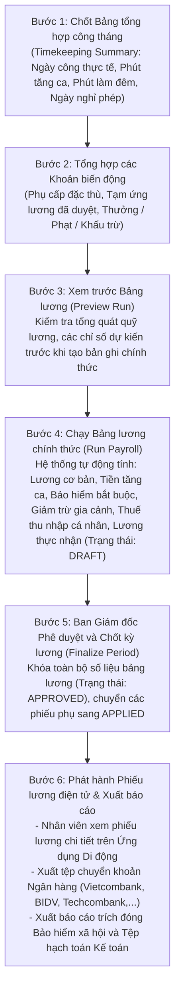

### 10.2 Bảng cơ cấu chi tiết từng Khoản mục trong Phiếu lương

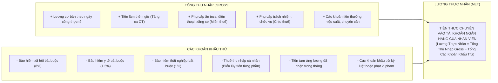

---

## CHƯƠNG 11: TOÀN BỘ CÔNG THỨC TÍNH TOÁN NGHIỆP VỤ TRONG HỆ THỐNG

Phần này trình bày chi tiết toàn bộ các công thức toán học và quy tắc nghiệp vụ được cài đặt trong hệ thống SmartHRM, giải thích rõ ràng từng biến số và kèm ví dụ số học thực tế minh họa từng bước.

---

### Công thức 1: Tính Số phút làm việc thực tế trong ngày (`WorkedMinutes`)

#### 1. Mục đích:

Tính chính xác số phút nhân viên thực sự làm việc trong ngày sau khi đã loại bỏ thời gian nghỉ trưa giữa ca.

#### 2. Công thức toán học:

$$
\text{Số phút quẹt thẻ thô (GrossMinutes)} = \text{Thời điểm bấm Ra ca (CheckOutAt)} - \text{Thời điểm bấm Vào ca (CheckInAt)}
$$

$$
\text{Số phút trùng giờ nghỉ trưa (BreakOverlap)} = \text{Phần giao giữa khoảng } [\text{CheckInAt}, \text{CheckOutAt}] \text{ và } [\text{BreakStartTime}, \text{BreakEndTime}]
$$

$$
\text{Số phút làm việc thực tế (WorkedMinutes)} = \max(0, \text{GrossMinutes} - \text{BreakOverlap})
$$

_Trường hợp ca làm việc không cấu hình mốc bắt đầu/kết thúc nghỉ trưa cụ thể mà chỉ có tổng số phút nghỉ trưa (`BreakMinutes`):_

$$
\text{Nếu GrossMinutes} > \text{BreakMinutes} \implies \text{WorkedMinutes} = \text{GrossMinutes} - \text{BreakMinutes}
$$

#### 3. Ví dụ minh họa thực tế:

- **Cấu hình ca chuẩn:** Giờ làm việc từ `08:00` đến `17:00`, nghỉ trưa từ `12:00` đến `13:00` (60 phút).
- **Dữ liệu quẹt thẻ thực tế của nhân viên:**
  - Chấm công Vào ca lúc: `07:55` sáng.
  - Chấm công Ra ca lúc: `17:05` chiều.
- **Từng bước tính toán:**
  - _Bước 1: Tính số phút quẹt thẻ thô:_
    $$
    \text{Từ 07:55 đến 17:05} = 9 \text{ tiếng } 10 \text{ phút} = 550 \text{ phút}.
    $$
  - *Bước 2: Tính số phút trùng giờ nghỉ trưa:*Khoảng quẹt thẻ $[07:55, 17:05]$ bao trọn hoàn toàn khung giờ nghỉ trưa $[12:00, 13:00] \implies \text{BreakOverlap} = 60 \text{ phút}$.
  - _Bước 3: Tính số phút làm việc thực tế:_
    $$
    \text{WorkedMinutes} = 550 - 60 = 490 \text{ phút}.
    $$
  - _Quy đổi ra ngày công:_ Nhân viên làm đủ 480 phút tiêu chuẩn và dư 10 phút $\implies$ Ghi nhận **1.0 ngày công chuẩn**.

---

### Công thức 2: Tính Số phút Đi muộn (`LateMinutes`) và Về sớm (`EarlyLeaveMinutes`)

#### 1. Mục đích:

Xác định chính xác số phút nhân viên đi làm muộn hoặc về sớm so với quy định của ca làm việc, sau khi đã áp dụng thời gian ân hạn miễn trừ (Grace Period).

#### 2. Công thức toán học:

$$
\text{Độ lệch vào ca} = \text{Thời điểm bấm Vào ca (CheckInAt)} - \text{Giờ bắt đầu ca quy chuẩn (StartTime)}
$$

$$
\text{Nếu Độ lệch vào ca} > \text{Số phút ân hạn đi muộn (LateGraceMinutes)} \implies \text{Số phút đi muộn (LateMinutes)} = \text{Độ lệch vào ca}
$$

$$
\text{Ngược lại (Độ lệch vào ca} \le \text{LateGraceMinutes}) \implies \text{LateMinutes} = 0 \text{ (Được tính là đúng giờ)}
$$

$$
\text{Độ lệch ra ca} = \text{Giờ kết thúc ca quy chuẩn (EndTime)} - \text{Thời điểm bấm Ra ca (CheckOutAt)}
$$

$$
\text{Nếu Độ lệch ra ca} > \text{Số phút ân hạn về sớm (EarlyLeaveGraceMinutes)} \implies \text{Số phút về sớm (EarlyLeaveMinutes)} = \text{Độ lệch ra ca}
$$

$$
\text{Ngược lại (Độ lệch ra ca} \le \text{EarlyLeaveGraceMinutes}) \implies \text{EarlyLeaveMinutes} = 0 \text{ (Được tính là đúng giờ)}
$$

#### 3. Ví dụ minh họa thực tế:

- **Cấu hình chuẩn chấm công:** Giờ ca từ `08:00` đến `17:00`; Thời gian ân hạn đi muộn `LateGraceMinutes = 10` phút; Thời gian ân hạn về sớm `EarlyLeaveGraceMinutes = 5` phút.
- **Trường hợp A:** Nhân viên vào ca lúc `08:08`.
  - Độ lệch vào ca: `08:08 - 08:00 = 8` phút.
  - Do 8 phút $\le 10$ phút ân hạn $\implies$ $\text{LateMinutes} = 0$ (Hệ thống ghi nhận **Đúng giờ**).
- **Trường hợp B:** Nhân viên vào ca lúc `08:15`.
  - Độ lệch vào ca: `08:15 - 08:00 = 15` phút.
  - Do 15 phút $> 10$ phút ân hạn $\implies$ $\text{LateMinutes} = 15$ phút (Hệ thống gắn nhãn **Đi muộn 15 phút**).
- **Trường hợp C:** Nhân viên về lúc `16:50`.
  - Độ lệch ra ca: `17:00 - 16:50 = 10` phút.
  - Do 10 phút $> 5$ phút ân hạn $\implies$ $\text{EarlyLeaveMinutes} = 10$ phút (Hệ thống gắn nhãn **Về sớm 10 phút**).

---

### Công thức 3: Tính Tiền lương Cơ bản theo Ngày công thực tế

#### 1. Mục đích:

Tính toán phần tiền lương cơ bản thực nhận trong tháng dựa trên tỷ lệ giữa số ngày công nhân viên thực tế đi làm và số ngày công tiêu chuẩn của tháng đó.

#### 2. Công thức toán học:

$$
\text{Lương cơ bản thực nhận} = \frac{\text{Mức lương cơ bản tháng (BasicSalary)}}{\text{Số ngày công tiêu chuẩn của tháng (StandardWorkingDays)}} \times \text{Số ngày công thực tế (ActualWorkingDays)}
$$

_Trong đó:_

- $\text{BasicSalary}$: Mức lương cơ bản ghi trên hợp đồng lao động hoặc quyết định lương gần nhất.
- $\text{StandardWorkingDays}$: Số ngày làm việc tiêu chuẩn trong tháng (thường là 22 ngày đối với doanh nghiệp nghỉ Thứ Bảy, Chủ Nhật; hoặc 26 ngày đối với doanh nghiệp làm cả Thứ Bảy).
- $\text{ActualWorkingDays}$: Tổng số ngày công thực tế nhân viên đi làm cộng với số ngày nghỉ phép hưởng nguyên lương trong tháng.

#### 3. Ví dụ minh họa thực tế:

- Mức lương cơ bản theo hợp đồng: **15.000.000 VNĐ / tháng**.
- Số ngày công tiêu chuẩn của Tháng 04/2026: **22 ngày**.
- Dữ liệu làm việc thực tế của nhân viên:
  - Đi làm thực tế đủ công: `20 ngày`.
  - Nghỉ phép năm có hưởng lương: `1 ngày`.
  - Nghỉ việc riêng không hưởng lương: `1 ngày`.
  - $\implies$ Tổng số ngày công thực tế $\text{ActualWorkingDays} = 20 + 1 = 21 \text{ ngày}$.

- **Từng bước tính toán:**

  $$
  \text{Đơn giá lương một ngày công} = \frac{15.000.000}{22} \approx 681.818,18 \text{ VNĐ / ngày}
  $$

  $$
  \text{Lương cơ bản thực nhận} = 681.818,18 \times 21 = \mathbf{14.318.182 \text{ VNĐ}}
  $$

---

### Công thức 4: Tính Tiền Làm thêm giờ (Tăng ca - Overtime)

#### 1. Mục đích:

Tính toán tiền thù lao làm thêm giờ của nhân viên theo đúng quy định tại Điều 98 của Bộ luật Lao động Việt Nam năm 2019.

#### 2. Công thức toán học:

$$
\text{Tiền lương một giờ làm việc bình thường} = \frac{\text{Lương cơ bản tháng}}{\text{Số ngày công tiêu chuẩn trong tháng} \times \text{Số giờ làm việc tiêu chuẩn một ngày (8 giờ)}}
$$

$$
\text{Tiền làm thêm giờ (OT)} = \text{Tiền lương một giờ bình thường} \times \text{Số giờ làm thêm} \times \text{Hệ số làm thêm giờ}
$$

_Bảng Hệ số làm thêm giờ theo Luật:_

- Làm thêm vào ngày làm việc bình thường: **Hệ số 150% (1.5)**.
- Làm thêm vào ngày nghỉ hàng tuần (Thứ Bảy / Chủ Nhật): **Hệ số 200% (2.0)**.
- Làm thêm vào ngày nghỉ Lễ, Tết, ngày nghỉ có hưởng lương: **Hệ số 300% (3.0)**.
- Nếu làm thêm giờ vào ban đêm (từ 22:00 đến 06:00 sáng): Được cộng thêm phụ trội ít nhất **30%** và thêm **20%** tiền lương tính theo ban ngày của ngày làm việc đó.

#### 3. Ví dụ minh họa thực tế:

- Lương cơ bản tháng: **12.000.000 VNĐ**.
- Ngày công tiêu chuẩn: **22 ngày** (mỗi ngày làm việc 8 tiếng).
  $$
  \text{Tiền lương 1 giờ bình thường} = \frac{12.000.000}{22 \times 8} = \frac{12.000.000}{176} \approx 68.182 \text{ VNĐ / giờ}
  $$
- Trong tháng nhân viên có các đợt tăng ca được duyệt như sau:
  - Tăng ca ngày thường: `10 giờ`.
  - Tăng ca ngày Chủ Nhật: `6 giờ`.
  - Tăng ca ngày Lễ Quốc Khánh: `4 giờ`.
- **Từng bước tính toán:**
  - _Tiền tăng ca ngày thường:_ $68.182 \times 10 \times 1.5 = 1.022.730 \text{ VNĐ}$.
  - _Tiền tăng ca ngày Chủ Nhật:_ $68.182 \times 6 \times 2.0 = 818.184 \text{ VNĐ}$.
  - _Tiền tăng ca ngày Lễ:_ $68.182 \times 4 \times 3.0 = 818.184 \text{ VNĐ}$.
  - $\implies$ **Tổng tiền làm thêm giờ (OT) nhận được:**
    $$
    1.022.730 + 818.184 + 818.184 = \mathbf{2.659.098 \text{ VNĐ}}
    $$

---

### Công thức 5: Tính Các khoản Trích đóng Bảo hiểm Bắt buộc (BHXH, BHYT, BHTN)

#### 1. Mục đích:

Tính toán chính xác phần nghĩa vụ đóng bảo hiểm bắt buộc trích trừ vào lương của Người lao động và phần nghĩa vụ chi trả của Người sử dụng lao động theo Luật Bảo hiểm xã hội Việt Nam.

#### 2. Tỷ lệ trích đóng quy chuẩn:

| Loại bảo hiểm                   | Tỷ lệ Người Lao Động đóng (Trừ vào lương) | Tỷ lệ Doanh Nghiệp đóng (Tính vào chi phí công ty) | Tổng tỷ lệ trích đóng toàn bộ |
| :------------------------------ | :---------------------------------------: | :------------------------------------------------: | :---------------------------: |
| **Bảo hiểm Xã hội (BHXH)**      |                 **8.0%**                  |                     **17.5%**                      |           **25.5%**           |
| **Bảo hiểm Y tế (BHYT)**        |                 **1.5%**                  |                      **3.0%**                      |           **4.5%**            |
| **Bảo hiểm Thất nghiệp (BHTN)** |                 **1.0%**                  |                      **1.0%**                      |           **2.0%**            |
| **Kinh phí Công đoàn**          |                 **0.0%**                  |                      **2.0%**                      |           **2.0%**            |
| **TỔNG CỘNG**                   |                 **10.5%**                 |                     **23.5%**                      |           **34.0%**           |

$$
\text{Tiền bảo hiểm trừ vào lương nhân viên} = \text{Mức lương đóng bảo hiểm} \times 10.5\%
$$

$$
\text{Tiền bảo hiểm doanh nghiệp chi trả} = \text{Mức lương đóng bảo hiểm} \times 23.5\%
$$

_(Lưu ý: Mức lương đóng bảo hiểm xã hội tối đa không vượt quá 20 lần mức lương cơ sở theo quy định của Chính phủ)._

#### 3. Ví dụ minh họa thực tế:

- Mức lương tham gia đóng bảo hiểm của nhân viên: **10.000.000 VNĐ**.
- **Phần trích trừ vào lương của nhân viên (10.5%):**
  - Trừ Bảo hiểm Xã hội (8%): $10.000.000 \times 8\% = 800.000 \text{ VNĐ}$.
  - Trừ Bảo hiểm Y tế (1.5%): $10.000.000 \times 1.5\% = 150.000 \text{ VNĐ}$.
  - Trừ Bảo hiểm Thất nghiệp (1%): $10.000.000 \times 1\% = 100.000 \text{ VNĐ}$.
  - $\implies$ **Tổng tiền bảo hiểm trừ vào lương:** $800.000 + 150.000 + 100.000 = \mathbf{1.050.000 \text{ VNĐ}}$.
- **Phần doanh nghiệp đóng thêm cho nhân viên (23.5%):**
  - $10.000.000 \times 23.5\% = \mathbf{2.350.000 \text{ VNĐ}}$.

---

### Công thức 6: Tính Thuế Thu nhập Cá nhân (TNCN) theo Biểu lũy tiến từng phần

#### 1. Mục đích:

Tính toán chính xác số thuế thu nhập cá nhân phải khấu trừ hàng tháng từ tiền lương, tiền công của người lao động cư trú ký hợp đồng từ đủ 03 tháng trở lên theo Luật Thuế Thu nhập Cá nhân Việt Nam.

#### 2. Các bước xác định thuế thu nhập cá nhân:

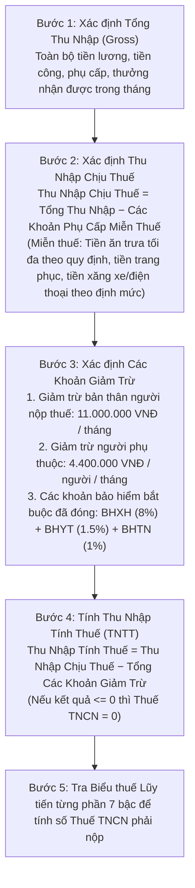

#### 3. Bảng Biểu thuế Lũy tiến từng phần 7 Bậc chuẩn Việt Nam:

| Bậc thuế  | Thu nhập tính thuế / tháng (Triệu VNĐ) | Thuế suất | Cách tính số thuế theo phương pháp rút gọn                      |
| :-------: | :------------------------------------- | :-------: | :-------------------------------------------------------------- |
| **Bậc 1** | Đến 5 triệu VNĐ                        |  **5%**   | $\text{Số thuế} = \text{TNTT} \times 5\%$                       |
| **Bậc 2** | Trên 5 triệu đến 10 triệu VNĐ          |  **10%**  | $\text{Số thuế} = \text{TNTT} \times 10\% - 0.25 \text{ triệu}$ |
| **Bậc 3** | Trên 10 triệu đến 18 triệu VNĐ         |  **15%**  | $\text{Số thuế} = \text{TNTT} \times 15\% - 0.75 \text{ triệu}$ |
| **Bậc 4** | Trên 18 triệu đến 32 triệu VNĐ         |  **20%**  | $\text{Số thuế} = \text{TNTT} \times 20\% - 1.65 \text{ triệu}$ |
| **Bậc 5** | Trên 32 triệu đến 52 triệu VNĐ         |  **25%**  | $\text{Số thuế} = \text{TNTT} \times 25\% - 3.25 \text{ triệu}$ |
| **Bậc 6** | Trên 52 triệu đến 80 triệu VNĐ         |  **30%**  | $\text{Số thuế} = \text{TNTT} \times 30\% - 5.85 \text{ triệu}$ |
| **Bậc 7** | Trên 80 triệu VNĐ                      |  **35%**  | $\text{Số thuế} = \text{TNTT} \times 35\% - 9.85 \text{ triệu}$ |

#### 4. Ví dụ minh họa thực tế tính Thuế Thu nhập Cá nhân:

- Nhân viên có tổng thu nhập trong tháng (Gross): **25.000.000 VNĐ**.
- Trong đó có phụ cấp ăn trưa miễn thuế: **730.000 VNĐ**.
- Đăng ký **01 người phụ thuộc** (con nhỏ) có hồ sơ hợp lệ.
- Đóng bảo hiểm bắt buộc trên mức lương 20.000.000 VNĐ $\implies$ Tiền bảo hiểm: $20.000.000 \times 10.5\% = 2.100.000 \text{ VNĐ}$.
- **Từng bước tính toán:**
  - _Bước 1: Tính Thu nhập chịu thuế:_
    $$
    \text{Thu nhập chịu thuế} = 25.000.000 - 730.000 = 24.270.000 \text{ VNĐ}
    $$
  - _Bước 2: Tính tổng các khoản giảm trừ:_
    - Giảm trừ bản thân: `11.000.000 VNĐ`
    - Giảm trừ người phụ thuộc (1 người): `4.400.000 VNĐ`
    - Giảm trừ bảo hiểm bắt buộc: `2.100.000 VNĐ`
    - $\implies$ $\text{Tổng giảm trừ} = 11.000.000 + 4.400.000 + 2.100.000 = 17.500.000 \text{ VNĐ}$
  - _Bước 3: Tính Thu nhập tính thuế (TNTT):_
    $$
    \text{Thu nhập tính thuế} = 24.270.000 - 17.500.000 = \mathbf{6.770.000 \text{ VNĐ}}
    $$
  - _Bước 4: Tính Thuế TNCN (Thu nhập 6.770.000 VNĐ nằm ở BẬC 2 - từ 5 đến 10 triệu):_
    - _Áp dụng công thức rút gọn:_
      $$
      \text{Thuế TNCN} = (\text{TNTT} \times 10\%) - 250.000 = (6.770.000 \times 10\%) - 250.000 = 677.000 - 250.000 = \mathbf{427.000 \text{ VNĐ}}
      $$

---

### Công thức 7: Tính Tiền Lương Thực nhận (Lương Net)

#### 1. Mục đích:

Tính toán số tiền cuối cùng chuyển vào tài khoản ngân hàng của nhân viên sau khi đã cộng đầy đủ các khoản thu nhập và trừ toàn bộ các nghĩa vụ tài chính trong tháng.

#### 2. Công thức toán học tổng hợp:

$$
\text{Lương Thực Nhận (Net)} = \text{Tổng Thu Nhập (Gross)} - \text{Bảo Hiểm Bắt Buộc (10.5\%)} - \text{Thuế TNCN} - \text{Tạm Ứng Đã Nhận} - \text{Các Khoản Khấu Trừ Khác}
$$

#### 3. Ví dụ minh họa thực tế:

- Lương cơ bản thực nhận: `15.000.000 VNĐ`
- Tiền làm thêm giờ (OT): `2.000.000 VNĐ`
- Phụ cấp trách nhiệm: `1.000.000 VNĐ`
- Phụ cấp ăn trưa: `730.000 VNĐ`
- $\implies$ $\text{Tổng thu nhập Gross} = 15.000.000 + 2.000.000 + 1.000.000 + 730.000 = 18.730.000 \text{ VNĐ}$.
- Các khoản khấu trừ:
  - Trừ bảo hiểm (10.5% mức 15 triệu): `1.575.000 VNĐ`
  - Trừ thuế TNCN: `185.000 VNĐ`
  - Đã tạm ứng giữa tháng: `3.000.000 VNĐ`
- $\implies$ **Lương Thực Nhận (Net) chuyển khoản:**
  $$
  \text{Lương Net} = 18.730.000 - 1.575.000 - 185.000 - 3.000.000 = \mathbf{13.970.000 \text{ VNĐ}}
  $$

---

### Công thức 8: Tính Số ngày Phép năm Tăng thêm theo Thâm niên

#### 1. Mục đích:

Tự động tính thêm ngày nghỉ phép năm cho người lao động làm việc lâu năm tại doanh nghiệp theo đúng quy định tại Điều 114 Bộ luật Lao động Việt Nam.

#### 2. Công thức toán học:

$$
\text{Số năm làm việc (Thâm niên)} = \frac{\text{Ngày hiện tại} - \text{Ngày bắt đầu làm việc (JoinDate)}}{365.25}
$$

$$
\text{Số ngày phép thâm niên cộng thêm} = \left\lfloor \frac{\text{Số năm làm việc}}{5} \right\rfloor \times 1 \text{ ngày}
$$

$$
\text{Tổng số ngày phép năm được hưởng} = \text{Số ngày phép tiêu chuẩn cơ bản (12 ngày)} + \text{Số ngày phép thâm niên cộng thêm}
$$

#### 3. Ví dụ minh họa thực tế:

- Nhân viên vào công ty ngày `01/01/2015`.
- Thời điểm xét phép năm: Ngày `01/01/2026` $\implies$ Số năm thâm niên làm việc: `11 năm`.
- **Từng bước tính toán:**

  $$
  \text{Số ngày phép thâm niên cộng thêm} = \left\lfloor \frac{11}{5} \right\rfloor = 2 \text{ ngày}
  $$

  $$
  \text{Tổng số ngày phép năm 2026 của nhân viên} = 12 + 2 = \mathbf{14 \text{ ngày phép / năm}}
  $$

---

## CHƯƠNG 12: QUẢN LÝ TUYỂN DỤNG NHÂN TÀI

### 12.1 Sơ đồ Quy trình Tuyển dụng Khép kín từ Định biên đến Nhân viên mới

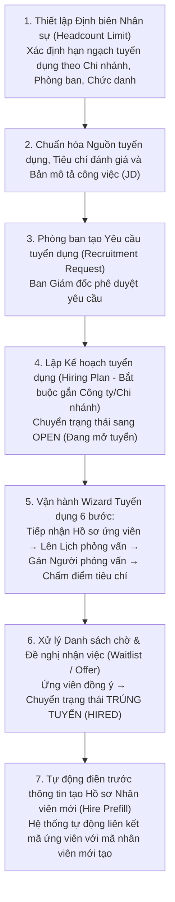

### 12.2 Hướng dẫn Vận hành Wizard Quy trình Tuyển dụng 6 Bước

Đường dẫn trên giao diện: **Tuyển dụng → Quy trình tuyển → Wizard quy trình** (`/recruitment/pipeline`)

| Bước trong Wizard | Tên bước thao tác             | Nhiệm vụ của chuyên viên nhân sự                                      | Điều kiện để chuyển sang bước tiếp theo              |
| :---------------: | :---------------------------- | :-------------------------------------------------------------------- | :--------------------------------------------------- |
|    **Bước 0**     | **Chọn Phạm vi Tổ chức**      | Chọn Công ty (bắt buộc) và Chi nhánh (tùy chọn)                       | Đã chọn Công ty trong danh sách                      |
|    **Bước 1**     | **Chọn Kế hoạch Tuyển dụng**  | Chọn một Kế hoạch tuyển dụng đang ở trạng thái`OPEN`                  | Đã chọn 1 Kế hoạch tuyển dụng hợp lệ                 |
|    **Bước 2**     | **Chọn / Thêm Ứng viên**      | Thêm mới hồ sơ ứng viên hoặc chọn ứng viên từ danh sách chờ           | Đã bấm chọn (highlight màu xanh) 1 ứng viên          |
|    **Bước 3**     | **Lên Lịch Phỏng vấn**        | Chọn ngày giờ phỏng vấn, phòng họp hoặc đường dẫn trực tuyến          | Đã tạo lịch phỏng vấn trạng thái`SCHEDULED`          |
|    **Bước 4**     | **Gán Người Phỏng vấn**       | Chọn cán bộ chuyên môn thuộc đúng công ty/chi nhánh tham gia đánh giá | Đã lưu danh sách người phỏng vấn                     |
|    **Bước 5**     | **Chấm điểm & Ra Quyết định** | Nhập điểm theo thang tiêu chí, hoàn tất phỏng vấn và đưa ra đề nghị   | Chuyển ứng viên sang`WAITLIST`, `OFFER` hoặc `HIRED` |

---

## CHƯƠNG 13: ĐÁNH GIÁ HIỆU SUẤT, QUẢN TRỊ MỤC TIÊU VÀ ĐÁNH GIÁ 360 ĐỘ

### 13.1 Mô hình Quản trị Hiệu suất Toàn diện

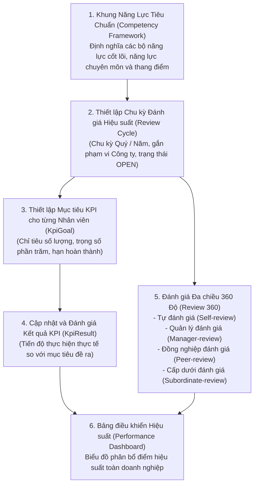

### 13.2 Danh mục các Màn hình trong Phân hệ Hiệu suất

Đường dẫn trên giao diện: **Phát triển nhân sự → Hiệu suất** (`/performance`)

1. **Khung năng lực** (`/performance/competency`): Quản lý các nhóm kỹ năng và tiêu chuẩn đánh giá năng lực.
2. **Chu kỳ đánh giá** (`/performance/review-cycle`): Tạo và đóng mở các đợt đánh giá định kỳ.
3. **Mục tiêu KPI** (`/performance/kpi-goal`): Giao chỉ tiêu định lượng cho từng cá nhân hoặc phòng ban.
4. **Kết quả KPI** (`/performance/kpi-result`): Nhập số liệu nghiệm thu và tính điểm hoàn thành.
5. **Đánh giá 360 độ** (`/performance/review-360`): Thực hiện phiếu đánh giá chéo giữa các cấp nhân sự.
6. **Bảng điều khiển** (`/performance/dashboard`): Biểu đồ phân tích tổng quan hiệu suất làm việc.

---

## CHƯƠNG 14: ĐÀO TẠO VÀ PHÁT TRIỂN NĂNG LỰC NHÂN SỰ

### 14.1 Chu trình Đào tạo Khép kín

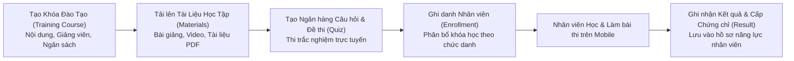

### 14.2 Bảng chi tiết các trường thông tin trong Khóa đào tạo

Đường dẫn trên giao diện: **Phát triển nhân sự → Đào tạo → Khóa đào tạo** (`/training/course`)

| Tên trường dữ liệu               | Ý nghĩa nghiệp vụ                  | Tên trường API          | Bắt buộc | Ghi chú                                                     |
| :------------------------------- | :--------------------------------- | :---------------------- | :------: | :---------------------------------------------------------- |
| **Mã khóa học**                  | Mã định danh duy nhất của khóa học | `Code`                  |  **Có**  | Ví dụ:`TRAIN_SECURITY_01`                                   |
| **Tên khóa học**                 | Tên chương trình đào tạo           | `Title`                 |  **Có**  | Ví dụ:_Đào tạo An toàn thông tin và Bảo mật 2026_           |
| **Công ty**                      | Công ty tổ chức khóa học           | `CompanyId`             |  **Có**  | Chọn từ danh mục công ty                                    |
| **Ngân sách dự kiến**            | Chi phí tổ chức đào tạo            | `BudgetAmount`          |  Không   | Đơn vị tính: VNĐ                                            |
| **Thời gian bắt đầu / kết thúc** | Khung thời gian diễn ra khóa học   | `StartDate` / `EndDate` |  **Có**  | Quản lý hạn đăng ký và học tập                              |
| **Trạng thái khóa học**          | Tình trạng mở khóa học             | `Status`                |  **Có**  | `DRAFT` (Dự thảo), `OPEN` (Đang mở), `CLOSED` (Đã kết thúc) |

---

## CHƯƠNG 15: QUẢN LÝ KỶ LUẬT VÀ XỬ LÝ VI PHẠM

### 15.1 Sơ đồ Quy trình Xử lý Vi phạm Kỷ luật

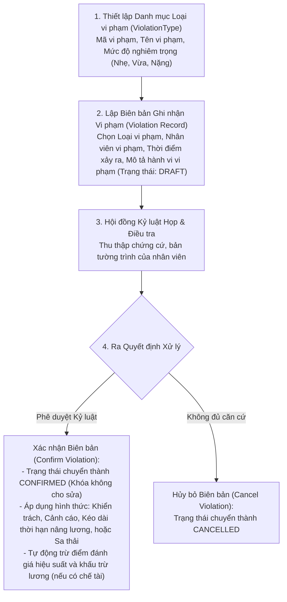

---

## CHƯƠNG 16: QUẢN LÝ TÀI SẢN VÀ TRANG THIẾT BỊ CẤP PHÁT

### 16.1 Quy trình Quản lý Vòng đời Tài sản Doanh nghiệp

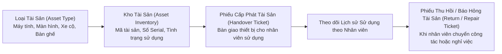

---

## CHƯƠNG 17: QUY TRÌNH ĐỘNG VÀ ĐỘNG CƠ PHÊ DUYỆT TỰ ĐỘNG

### 17.1 Kiến trúc Động cơ Quy trình (Workflow Engine)

Hệ thống cung cấp Động cơ Quy trình linh hoạt cho phép doanh nghiệp tự thiết kế các biểu mẫu điện tử và quy trình phê duyệt đa cấp không giới hạn:

```mermaid
flowchart TD
  W1["1. Thiết kế Biểu mẫu Điện tử Động (Workflow Form Template)<br/>Kéo thả các trường dữ liệu: Văn bản, Số tiền, Ngày tháng, Danh sách chọn, Tệp đính kèm"] --> W2["2. Định nghĩa Quy trình Phê duyệt Đa cấp (Workflow Definition)<br/>- Bước 1: Trưởng nhóm duyệt<br/>- Bước 2: Trưởng phòng ban duyệt (Điều kiện: Nếu số tiền > 5.000.000 VNĐ)<br/>- Bước 3: Ban Giám đốc phê duyệt cuối cùng"]
  W2 --> W3["3. Nhân viên Khởi tạo Yêu cầu (Workflow Instance)<br/>Điền biểu mẫu và gửi duyệt trực tiếp từ Web hoặc Ứng dụng Di động"]
  W3 --> W4["4. Hộp thư Xử lý Phê duyệt Tập trung (Workflow Inbox)<br/>Người duyệt nhận thông báo thời gian thực và thực hiện Phê duyệt (Advance) hoặc Từ chối (Reject)"]
```

---

## CHƯƠNG 18: VẬN HÀNH ỨNG DỤNG DI ĐỘNG SMARTHRM MOBILE

### 18.1 Hướng dẫn Toàn diện dành cho Nhân viên

Ứng dụng di động SmartHRM Mobile được tổ chức thành 5 tab chức năng chính và 1 trung tâm mở rộng:

```mermaid
flowchart TD
  APP["ỨNG DỤNG DI ĐỘNG SMARTHRM MOBILE"]
  APP --> TAB1["1. Tab Trang Chủ (Home):<br/>- Xem ca làm việc hôm nay & thời gian nghỉ trưa<br/>- Bấm Vào Ca / Ra Ca với Định vị GPS<br/>- Xem tin tức thông báo nội bộ mới nhất"]
  APP --> TAB2["2. Tab Chấm Công (Attendance):<br/>- Xem lịch công cả tháng với màu sắc trực quan<br/>- Xem tổng số giờ công đã làm / chỉ tiêu giờ công<br/>- Bấm vào từng ngày để xem chi tiết giờ vào ra<br/>- Gửi đơn Khiếu nại chấm công khi quên quẹt thẻ"]
  APP --> TAB3["3. Tab Đơn Từ (Leaves & Requests):<br/>- Tra cứu số ngày phép năm còn lại khả dụng<br/>- Tạo đơn xin nghỉ phép (Nửa ngày / Cả ngày)<br/>- Tạo đơn đăng ký làm thêm giờ (Tăng ca OT)<br/>- Theo dõi tiến độ phê duyệt của người quản lý"]
  APP --> TAB4["4. Tab Tiền Lương (Salary):<br/>- Tra cứu danh sách phiếu lương theo từng tháng<br/>- Xem chi tiết từng khoản thu nhập, bảo hiểm, thuế<br/>- Mở và tải bản Phiếu lương điện tử chuẩn HTML"]
  APP --> TAB5["5. Tab Cá Nhân (Profile) & Trung tâm Mở rộng (/more):<br/>- Xem và cập nhật thông tin cá nhân, liên hệ<br/>- Thay đổi mật khẩu & Cài đặt bảo mật Sinh trắc học (Vân tay / Face ID)<br/>- Xem Hợp đồng lao động, Giấy tờ hồ sơ điện tử<br/>- Tra cứu Danh bạ điện thoại nội bộ & Sơ đồ tổ chức<br/>- Tham gia Khóa đào tạo trực tuyến & Làm bài kiểm tra<br/>- Đánh giá chỉ tiêu KPI & Đánh giá 360 độ"]
```

### 18.2 Hướng dẫn Toàn diện dành cho Cán bộ Quản lý

Cán bộ Quản lý được cấp thêm các công cụ giám sát và điều hành trực tiếp trên ứng dụng di động:

1. **Hộp thư Phê duyệt Tập trung (Approval Inbox):** Xem toàn bộ danh sách đơn xin nghỉ phép, đơn tăng ca của nhân viên cấp dưới đang chờ duyệt; xem lý do, số dư phép và thực hiện phê duyệt ngay trên điện thoại.
2. **Lịch Nghỉ Toàn Đội ngũ (Team Calendar):** Theo dõi trực quan lịch nghỉ phép của toàn bộ nhân viên trong phòng ban để chủ động sắp xếp và phân bổ công việc.
3. **Bảng công Đội ngũ (Team Attendance):** Giám sát tình hình đi làm đúng giờ, đi muộn, về sớm của nhân viên dưới quyền theo thời gian thực.
4. **Bảng điều khiển Quản lý (Manager Dashboard):** Tổng hợp quân số đi làm, tỷ lệ nghỉ phép và các cảnh báo nhân sự quan trọng trong ngày.

---

## PHỤ LỤC: DANH MỤC MÃ QUYỀN, BẢNG TRA CỨU LỖI VÀ HƯỚNG DẪN XỬ LÝ SỰ CỐ

### Phụ lục A: Danh mục Toàn bộ Mã Quyền Hệ thống (Permission Catalog)

| Nhóm phân hệ         | Mã quyền hệ thống                 | Ý nghĩa và Phạm vi tác vụ cho phép                                          |
| :------------------- | :-------------------------------- | :-------------------------------------------------------------------------- |
| **Cơ cấu Tổ chức**   | `ORGANIZATION_VIEW`               | Quyền xem danh sách công ty, chi nhánh, phòng ban, bộ phận và sơ đồ tổ chức |
|                      | `ORGANIZATION_MANAGE`             | Quyền tạo, sửa, xóa và kéo thả thay đổi cấu trúc sơ đồ tổ chức              |
| **Hồ sơ Nhân sự**    | `HUMAN_RESOURCE_EMPLOYEE_VIEW`    | Quyền xem danh sách và chi tiết hồ sơ lý lịch nhân viên                     |
|                      | `HUMAN_RESOURCE_EMPLOYEE_CREATE`  | Quyền tạo mới hồ sơ nhân viên và tài khoản người dùng                       |
|                      | `HUMAN_RESOURCE_EMPLOYEE_UPDATE`  | Quyền chỉnh sửa thông tin hồ sơ nhân viên, bằng cấp, người phụ thuộc        |
|                      | `HUMAN_RESOURCE_EMPLOYEE_DELETE`  | Quyền xóa hoặc vô hiệu hóa hồ sơ nhân viên                                  |
|                      | `HUMAN_RESOURCE_TRANSFER_CREATE`  | Quyền lập quyết định điều chuyển phòng ban, chi nhánh nhân viên             |
| **Chấm công & Ca**   | `OPERATE_TIMEKEEPING_VIEW`        | Quyền xem bảng chấm công hàng ngày và bảng tổng hợp tháng                   |
|                      | `OPERATE_TIMEKEEPING_ADJUST`      | Quyền điều chỉnh thủ công giờ quẹt thẻ và trạng thái ngày công              |
|                      | `OPERATE_SHIFT_MANAGE`            | Quyền cấu hình ca làm việc mẫu và mẫu ca tuần mặc định                      |
|                      | `OPERATE_OVERTIME_APPROVE`        | Quyền phê duyệt hoặc từ chối các đơn đăng ký làm thêm giờ (OT)              |
|                      | `OPERATE_COMPLAINT_REVIEW`        | Quyền xem xét và phê duyệt các đơn khiếu nại chấm công                      |
| **Nghỉ phép**        | `OPERATE_LEAVE_VIEW`              | Quyền xem danh sách đơn nghỉ phép và lịch nghỉ toàn công ty                 |
|                      | `OPERATE_LEAVE_CREATE`            | Quyền tạo đơn xin nghỉ phép (cho cá nhân hoặc tạo hộ nhân viên)             |
|                      | `OPERATE_LEAVE_APPROVE`           | Quyền phê duyệt hoặc từ chối đơn xin nghỉ phép của nhân viên                |
|                      | `OPERATE_LEAVE_ALLOCATION_MANAGE` | Quyền cấp phát và điều chỉnh hạn mức quỹ phép năm                           |
| **Tiền lương**       | `PAYROLL_SALARY_VIEW`             | Quyền xem bảng tính lương và chi tiết phiếu lương nhân viên                 |
|                      | `PAYROLL_SALARY_RUN`              | Quyền thực hiện chạy tính toán bảng lương và chốt kỳ lương                  |
|                      | `PAYROLL_ALLOWANCE_MANAGE`        | Quyền cấu hình danh mục và hệ số các khoản phụ cấp lương                    |
|                      | `PAYROLL_ADVANCE_APPROVE`         | Quyền xem xét và phê duyệt các đơn xin tạm ứng tiền lương                   |
| **Tuyển dụng**       | `RECRUITMENT_PLAN_MANAGE`         | Quyền lập và phê duyệt kế hoạch tuyển dụng nhân tài                         |
|                      | `RECRUITMENT_CANDIDATE_MANAGE`    | Quyền quản lý hồ sơ ứng viên và chuyển đổi trạng thái trúng tuyển           |
|                      | `RECRUITMENT_INTERVIEW_MANAGE`    | Quyền lên lịch phỏng vấn và chấm điểm đánh giá ứng viên                     |
| **Phân quyền**       | `ROLE_VIEW`                       | Quyền xem danh sách vai trò và phân quyền tài khoản                         |
|                      | `ROLE_MANAGE`                     | Quyền tạo vai trò mới, gán quyền cho vai trò và gán vai trò cho nhân viên   |
| **Ứng dụng Di động** | `MOBILE_ACCESS`                   | Quyền cơ sở cho phép đăng nhập và sử dụng ứng dụng SmartHRM Mobile          |

---

### Phụ lục B: Bảng Tra cứu Lỗi Thường gặp và Hướng dẫn Xử lý Sự cố

| Hiện tượng / Thông báo lỗi                                                   | Nguyên nhân kỹ thuật                                                                                              | Hướng dẫn cách xử lý khắc phục                                                                                                                                                                       |
| :--------------------------------------------------------------------------- | :---------------------------------------------------------------------------------------------------------------- | :--------------------------------------------------------------------------------------------------------------------------------------------------------------------------------------------------- |
| **"Bạn đang ở ngoài bán kính cho phép chấm công"**                           | Tọa độ GPS của điện thoại cách xa tọa độ văn phòng vượt quá bán kính`AllowedRadiusMeters`                         | 1. Di chuyển vào đúng khu vực văn phòng làm việc.2. Kiểm tra bật độ chính xác cao của GPS trên điện thoại.3. Quản trị viên kiểm tra lại cấu hình Kinh độ/Vĩ độ của Chi nhánh/Công ty trên Web Admin. |
| **"Hôm nay không phải ngày làm việc của bạn hoặc chưa được phân ca"**        | Nhân viên chưa được gán Mẫu ca tuần mặc định (`Work Pattern`) hoặc hôm nay là ngày nghỉ cuối tuần                 | 1. Quản trị viên vào**Vận hành → Ca / Lịch → Tab Ca mặc định** để gán ca làm việc cho nhân viên.2. Nếu là làm thêm ngày nghỉ, Quản trị viên cần tạo lịch phân ngày ngoại lệ (`Work Schedule`).       |
| **Ứng dụng hiển thị số ngày phép năm còn lại là 0 hoặc "Chưa cấp phát"**     | Nhân sự chưa thực hiện cấp phát Quỹ phép năm (`DayOffAllocation`) cho nhân viên trong năm hiện tại                | Nhân sự vào**Vận hành → Nghỉ phép → Quỹ phép** để nhập số ngày phép được cấp cho nhân viên theo năm.                                                                                                 |
| **Cán bộ Quản lý không thấy đơn của nhân viên cấp dưới trong Hộp thư duyệt** | Phòng ban hoặc Bộ phận chưa được gán mã Quản lý (`ManagerId`), hoặc tài khoản chưa được gán quyền `LEAVE_APPROVE` | 1. Vào**Tổ chức → Phòng ban / Bộ phận** kiểm tra và chọn đúng cán bộ quản lý.2. Vào **Phân quyền** kiểm tra tài khoản quản lý đã được gán vai trò `MANAGER` chưa.                                    |
| **Không tải được hình ảnh đại diện hoặc tệp đính kèm (Lỗi 404)**             | Cấu hình tài nguyên tĩnh trong tệp cấu hình`angular.json` bị thiếu đường dẫn xuất thư mục                         | Kiểm tra cấu hình`assets` trong `angular.json` đảm bảo có khai báo `"output": "assets"`.                                                                                                             |
| **Lỗi "ExpressionChangedAfterItHasBeenCheckedError" khi tải sơ đồ tổ chức**  | Biến trạng thái tải dữ liệu (`loading`) bị thay đổi trong quá trình Angular đang chạy vòng kiểm tra               | Đã được xử lý triệt để bằng việc áp dụng`ChangeDetectorRef.markForCheck()` trong mã nguồn thành phần.                                                                                                |

---

> **Ghi chú kết thúc tài liệu:** Toàn bộ nội dung trong tài liệu này phản ánh chính xác 100% cấu trúc cơ sở dữ liệu, các điểm kết nối API và giao diện thực tế của hệ thống SmartHRM. Khi có bất kỳ sự thay đổi hoặc bổ sung tính năng mới, tài liệu sẽ được cập nhật phiên bản tương ứng.
