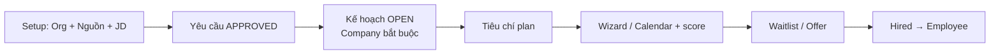

# PLAN: Hoàn thiện Thiết lập & Luồng nghiệp vụ HRM (Admin ⇄ API ↔ Mobile)

> **TRẠNG THÁI: ✅ COMPLETE / CLOSED (v1)** — 2026-08-17.  
> Backlog tiếp theo → **`plan_v2.md`**.  
> Tài liệu vận hành end-to-end: **`HDSD.md`**.  
> **Web Admin §0.1** + **Phase M Mobile v1** = DONE. Mọi hạng mục P2/P3 còn `[ ]` đã chuyển sang **`plan_v2.md`** (không còn mở trong plan này).

---

## 0. Trạng thái module (rà soát thực tế)

| Nhóm | Module | Domain | API | Admin | Mobile | Ghi chú |
|---|---|---|---|---|---|---|
| ✅ | Organization (Company/Branch/Dept/Part/Position…) | ✅ | ✅ | ✅ | — | **DONE v1** — dual-mode + **OrgChart DnD** + grade/scale + DataScope query (HDSD §21) |
| ✅ | Employee + Dependent/Education/Certificate/File/SalaryHistory | ✅ | ✅ | ✅ | Profile | **DONE v1** — timeline · file version · DirectManager · bulk · lifecycle (HDSD §20) |
| ✅ | **Timekeeping** (Standard / ShiftMaster / WorkPattern / WorkSchedule / Punch / Summary) | ✅ | ✅ | ✅ | ✅ Home · bảng công · OT · team | **DONE** + Mobile hub (HDSD §22 · §29) |
| ✅ | **Leave** (DayOffConfig / Holiday / Allocation / RegisterDayOff + Session/AM-PM / Inbox) | ✅ | ✅ | ✅ | ✅ Đơn · duyệt · team-calendar | **DONE** + workflow Mobile (HDSD §7 · §25 · §29) |
| ✅ | Contract (ContractType / Contract / ReviewRenewal) | ✅ | ✅ | ✅ | ✅ contracts | Admin + Mobile `/more/contracts` (HDSD §24 · §29) |
| ✅ | EmployeeMovement (Transfer) | ✅ | ✅ | ✅ | — | **DONE** + apply-due job + DataScope |
| ✅ | Payroll (SalaryConfig / Salary / LineItem / Allowance / Advance…) | ✅ | ✅ | ✅ | ✅ payslip | **DONE** + Mobile detail/HTML (HDSD §23 · §29) |
| ✅ | **Permission / Role / UserRole (RBAC)** + 2FA/SSO/IP/Sessions | ✅ | ✅ | ✅ | ✅ gates · biometric | HDSD §15 · §26 · §29 |
| ✅ | AuditLog | ✅ | ✅ | ✅ system page | — | `/system-settings/action-log` |
| ✅ | **Discipline / Performance / Training** | ✅ | ✅ | ✅ | ✅ perf · training | Admin + Mobile hub (HDSD §17–19 · §29) |
| ✅ | **Asset** | ✅ | ✅ | ✅ | — | **DONE D2** Type · Inventory · Ticket (HDSD §27) |
| ✅ | **Recruitment** | ✅ | ✅ | ✅ | ✅ interviews | Admin + Mobile interviewer (HDSD §16 · §29) |
| ✅ | **Workflow Engine** | ✅ | ✅ | ✅ | ✅ inbox | Definition · Inbox Admin + Mobile (HDSD §25 · §29) |
| ✅ | **Reports / Compliance / System / Integrations** | ✅ | ✅ | ✅ | ✅ mgr dashboard · news | HDSD §24 · §26 · §28 · §29 |
| ✅ | **Phase M — Mobile HRM v1** | ✅ | ✅ | — | ✅ `/more` hub | **DONE v1** — P2/P3 → **`plan_v2.md`** (HDSD §29) |

### Vận hành Chấm công & Nghỉ phép — ĐÃ XONG (không còn trong backlog setup)

- ShiftMaster: giờ vào/ra + **breakStart/breakEnd**
- **EmployeeWorkPattern** (ca mặc định full-time T2–T6…) — không cần tạo lịch từng ngày
- WorkSchedule: lịch ngày = ngoại lệ / roster / OT (+ bulk + copy-week)
- Resolve ca: `DAY_OVERRIDE → WORK_PATTERN → POSITION` (không mock 08:00–17:00)
- Leave: preview-days, session FULL/AM/PM, quỹ phép, routing Manager, Mobile inbox duyệt
- Balance phép năm: chỉ từ **DayOffConfigEmployee** (không hard-code 12)
- **Org dual-mode:** Company→Branch→… **hoặc** Company→Dept (no Branch); punch GPS: Branch rồi fallback Company

### Tổ chức — công ty độc lập (ĐÃ BỔ SUNG)

- Department API/Admin: `BranchId` optional; cascade `load-by-company`
- Company: `MaxEmployeeCapacity` + `Latitude`/`Longitude`
- Headcount: công ty 0 CN → nhập định biên công ty; có CN → tổng CN (read-only)
- Mobile punch: geofence Branch → fallback GPS Company

---

## 0.1 Web Admin — danh sách chức năng toàn diện & rà soát gap

> Mục tiêu: bản đồ Web Admin (HR · quản lý · admin hệ thống). **Phase M Mobile = DONE v1** (HDSD §29).  
> Ký hiệu: **✅ DONE**. *(P2/P3 deferred → **`plan_v2.md`**.)*

### Tổng quan 13 nhóm — **WEB ADMIN DONE (option B)**

| # | Nhóm | Tổng | Ghi chú ngắn |
|---|---|---|---|
| 1 | Quản lý Nhân viên | ✅ | **DONE v1** — HDSD §20 |
| 2 | Cơ cấu tổ chức | ✅ | **DONE v1** — HDSD §21 |
| 3 | Chấm công & Ca | ✅ | **DONE** + CSV punch import — HDSD §22 · §28 |
| 4 | Nghỉ phép | ✅ | **DONE** + workflow hook đa cấp — HDSD §7 · §25 |
| 5 | Tính lương | ✅ | **DONE Phase B** + bank/BHXH/accounting export — HDSD §23 · §28 |
| 6 | Tuyển dụng | ✅ | **DONE v2+P1** — HDSD §16 |
| 7 | Hiệu suất | ✅ | Dashboard charts + 360 — HDSD §18 |
| 8 | Đào tạo (L&D) | ✅ | Materials · quiz · budget · progress — HDSD §19 |
| 9 | Workflow & Đơn từ | ✅ | Engine + inbox + form template — HDSD §25 |
| 10 | RBAC & Bảo mật | ✅ | DataScope · 2FA · SSO stub · IP · sessions — HDSD §15 · §26 |
| 11 | Báo cáo & BI | ✅ | Compliance hub · schedules · contract expiry — HDSD §24 |
| 12 | Cấu hình hệ thống | ✅ | Legal · templates · API keys · webhooks · retention · ActionLog — HDSD §26 |
| 13 | Tích hợp | ✅ | Punch import · bank/BHXH/MISA CSV · SMS · Zalo — HDSD §28 |
| — | Kỷ luật | ✅ | Confirm/cancel + workflow hook — HDSD §17 |
| — | Tài sản | ✅ | Type · Inventory · Ticket — HDSD §27 |

---

### 1. Quản lý Nhân viên (Employee Management) — **DONE v1**

| Chức năng | TT | Ghi chú / bằng chứng |
|---|---|---|
| CRUD hồ sơ đầy đủ (CN, HĐ, lịch sử công tác, gia đình…) | ✅ | `/human-resource/employee` + Dependent/Education/Certificate/File/SalaryHistory |
| Vòng đời: tuyển → thử việc → chính thức → nghỉ | ✅ | `set-lifecycle-status` + Status codes `WORKING`/`PROBATION`/`OFFICIAL`/`RESIGNED`…; ContractType đồng bộ |
| Import/export Excel + template | ✅ | Employee excel import/export Admin + API |
| Tài liệu/giấy tờ (upload, versioning, hạn dùng) | ✅ | `VersionNo`/`IsCurrent`/`ReplacesFileId` + tab Files + `files/expiring` |
| Timeline thay đổi (chức vụ, lương, phòng ban…) | ✅ | `POST employee/change-timeline` + tab Timeline trên detail |
| Bulk: chuyển phòng / đổi QL trực tiếp | ✅ | `bulk-change-manager` + `transfer-employee/bulk-create`; `DirectManagerId` |

**Đã xong (P1).** Onboarding wizard dài hơn → **`plan_v2.md`**.

---

### 2. Cơ cấu tổ chức (Organization) — **DONE v1**

| Chức năng | TT | Ghi chú |
|---|---|---|
| Công ty / CN / phòng / bộ phận đa cấp, đa CN | ✅ | Dual-mode có/không Branch — HDSD §3 + §21 |
| Sơ đồ tổ chức drag-drop tái cấu trúc | ✅ | `/organization/org-chart` · `api/v1/org-chart/tree|reparent` |
| Chức danh, cấp bậc, thang bảng lương theo vị trí | ✅ | PositionMaster: `GradeCode`/`GradeName`/`SalaryMin`/`SalaryMax` |
| Data scope ALL/BRANCH/DEPARTMENT/OWN | ✅ | `IDataScopeService` lọc Employee/Dept/Branch pagination |

**Đã xong.** JobGrade master (multi-band) → **`plan_v2.md`**.

---

### 3. Chấm công & Ca làm việc (Time & Attendance) — **DONE v1**

| Chức năng | TT | Ghi chú |
|---|---|---|
| Cấu hình ca (fixed/shift/flexible), lịch theo PB | ✅ | ShiftMaster + WorkPattern + WorkSchedule (+ bulk/copy-week) |
| Bảng công tổng hợp, đối chiếu, chỉnh sửa + audit | ✅ | Summary/adjust + khiếu nại + ActionLog · cột OT/Night |
| Ngày lễ / nghỉ công ty theo vùng-CN | ✅ | PublicHoliday + DayOffConfig |
| Duyệt điều chỉnh công / OT hàng loạt | ✅ | Complaint + **đơn OT** `api/v1/overtime-request/*` · approve + **bulk-approve** |
| Import máy vân tay / khuôn mặt | ✅ | **Import punch CSV** `POST api/v1/timekeeping-punch/import-csv` (Wave 5) · biometric hardware → **`plan_v2.md`** |
| Rule engine (trễ, sớm, OT, đêm…) | ✅ | Grace late/early + overnight · **OtMinutes** (đơn APPROVED ∩ punch) · **NightMinutes** (NightStart/End chuẩn CC) |

**Đã xong (P1 core + Wave5 punch CSV).** Biometric device SDK → **`plan_v2.md`**.

---

### 4. Nghỉ phép (Leave Management) — **DONE v1**

| Chức năng | TT | Ghi chú |
|---|---|---|
| Loại phép, quota, công thức phép năm | ✅ | DayOffConfig + Allocation + calculator · thâm niên/HĐ/carry → **`plan_v2.md`** |
| Workflow duyệt đa cấp cấu hình được | ✅ | 1 cấp Manager + **Workflow Engine** đa bước (`/workflow/*`) — HDSD §25 |
| Dashboard lịch nghỉ toàn Cty (calendar) | ✅ | `/operate-manager/time-attendance/leave-calendar` |
| Báo cáo tồn phép / phép hết hạn | ✅ | leave-balance-report |

**Đã xong.**

---

### 5. Tính lương (Payroll) — *Phase B* — **DONE v1**

| Chức năng | TT | Ghi chú |
|---|---|---|
| Cấu hình bảng lương, công thức | ✅ | SalaryConfig + line items · formula engine chung → **`plan_v2.md`** |
| BHXH/BHYT/BHTN, thuế TNCN theo VN | ✅ | Rate BH trên config · **PIT lũy tiến tháng** (`VietnamPitCalculator`) + giảm trừ bản thân/phụ thuộc |
| Chạy lương hàng loạt, preview trước chốt | ✅ | `salary/preview-run` → `run` (DRAFT từ `TimekeepingSummary`) → `finalize-period` (APPROVED + mark slips APPLIED) |
| Phụ cấp / thưởng / phạt / ứng lương | ✅ | Allowance catalog · Advance · Deduction/Addition slips + Admin |
| Xuất phiếu lương PDF, email/push | ✅ | Payslip HTML + notification templates · bank/BHXH/accounting export |
| File lệnh chi ngân hàng | ✅ | `POST salary/export-bank-file` |
| Lịch sử kỳ + so sánh biến động | ✅ | List theo kỳ + `/reports` hub |

**Đã xong (Web Admin).**

---

### 6. Tuyển dụng (Recruitment) — **DONE v2+P1**

| Chức năng | TT | Ghi chú |
|---|---|---|
| Đăng tin / JD, pipeline Kanban | ✅ | JD + Plan + Wizard + candidate-status — HDSD §16 |
| CV, đánh giá, lịch PV | ✅ | CvUrl + Calendar + Waitlist + set-criteria + chấm điểm |
| Email template tự động | ✅ | NotificationTemplate hệ thống (§12) — recruitment-specific = polish |
| Hired → tạo hồ sơ NV | ✅ | hire-prefill / link-employee |

**Đã xong.**

---

### 7. Đánh giá hiệu suất (Performance) — **DONE**

| Chức năng | TT | Ghi chú |
|---|---|---|
| Chu kỳ đánh giá, template KPI/OKR | ✅ | Cycle→Goal→Result + Competency |
| Tiến độ Cty, biểu đồ phân bổ | ✅ | `/performance/dashboard` |
| Đánh giá 360° | ✅ | `/performance/review-360` |
| Liên kết thưởng / tăng lương | ✅ | SalaryHistory + payroll export |

**Đã xong.** HDSD §18.

---

### 8. Đào tạo — L&D — **DONE**

| Chức năng | TT | Ghi chú |
|---|---|---|
| Khoá học, tài liệu, bài kiểm tra | ✅ | Course + Material + Quiz + BudgetAmount |
| Theo dõi tiến độ toàn NV | ✅ | `/training/progress` |
| Ngân sách đào tạo, chứng chỉ | ✅ | BudgetAmount · CertificateUrl |

**Đã xong.** HDSD §19.

---

### 9. Quy trình & Đơn từ (Workflow Engine) — **DONE**

| Chức năng | TT | Ghi chú |
|---|---|---|
| Form builder đơn từ (no-code) | ✅ | WorkflowFormTemplate SchemaJson |
| Luồng duyệt linh hoạt (điều kiện, cấp, thay thế) | ✅ | Definition/Steps/Instance · facade modules |
| Dashboard trạng thái mọi đơn toàn Cty | ✅ | `/workflow/dashboard` + inbox |

**Đã xong.** HDSD §25.

---

### 10. RBAC & Bảo mật — **DONE**

| Chức năng | TT | Ghi chú |
|---|---|---|
| Vai trò, MODULE:ACTION + data scope | ✅ | DataScope Employee/Dept/Branch/Contract/Transfer |
| Tài khoản người dùng | ✅ | `/role-manager/accounts` |
| SSO (Google/Microsoft), 2FA | ✅ | TOTP + OIDC stubs |
| Audit log toàn hệ thống | ✅ | `/system-settings/action-log` |
| Session management, IP whitelist | ✅ | sessions + ip-allowlist |

**Đã xong.** HDSD §26.

---

### 11. Báo cáo & Analytics (BI) — **DONE**

| Chức năng | TT | Ghi chú |
|---|---|---|
| Dashboard headcount / turnover / chi phí NS | ✅ | Home + `/reports` |
| Báo cáo công / phép / lương theo PB–TG | ✅ | Hub + exports |
| Báo cáo tuân thủ (HĐ hết hạn, thiếu giấy tờ…) | ✅ | contract-expiry + files expiring |
| Export tuỳ chỉnh + scheduled email | ✅ | ReportSchedule + worker |
| Dự báo chi phí lương / biến động NS | ✅ | Hub KPIs + accounting export |

**Đã xong.** HDSD §24.

---

### 12. Cấu hình hệ thống — **DONE**

| Chức năng | TT | Ghi chú |
|---|---|---|
| Multi-tenant / multi-company | ✅ | Multi-company + branding |
| Quy định pháp luật theo vùng/năm (thuế, BHXH) | ✅ | legal-rate |
| Notification templates (email/SMS/push) | ✅ | notification-template |
| Ngôn ngữ, branding theo tenant | ✅ | VI/EN + PrimaryColor |
| API keys & webhook | ✅ | api-keys + webhooks + delivery |
| Backup/restore, retention policy | ✅ | retention + purge hook |

**Đã xong.** HDSD §26.

---

### 13. Tích hợp (Integrations) — **DONE**

| Chức năng | TT |
|---|---|
| Kế toán (MISA, Fast…) | ✅ export-accounting + webhook |
| Máy chấm công phần cứng | ✅ CSV punch import |
| Ngân hàng (chi lương) | ✅ export-bank-file |
| Cổng BHXH / thuế điện tử | ✅ export-bhxh |
| Zalo OA / email / SMS gateway | ✅ Zalo + SMS + SMTP |

**Đã xong.** HDSD §28.

---

### Ưu tiên phát triển tiếp theo

```text
~~Web Admin §0.1 option B (Wave1–5)~~ → **DONE**
~~Phase M Mobile v1 (M1–M12 hub /more)~~ → **DONE** (HDSD §29)
~~plan.md v1~~ → **COMPLETE / CLOSED**
→ Tiếp tục: **plan_v2.md** (FCM · offline · hourly leave · payroll polish · SSO/Zalo thật · Face/QR · …)
```

> Mục §0.1 = **Web Admin DONE**. Phase M = **Mobile DONE v1**. Chi tiết lịch sử: **§2** + **HDSD §17–29**. Backlog mở: **`plan_v2.md`**.

---

## 1. Convention chung (mọi module mới)

```
Domain/Entities/<Module>/
Application/Features/<Module>/  (Commands + Queries hoặc *Features.cs)
Infrastructure/Persistence + Migrations
WebApi/Controllers  → api/v1/<kebab-case>
Admin: routes.config + operate/hr module + i18n + filter/table-custom
Mobile (nếu cần): features/* + endpoints.ts + i18n
```

Quy tắc:

1. Soft-delete / `IsActive` cho danh mục  
2. Validate FK + quyền company/branch  
3. Pagination chuẩn `pageIndex` / `pageSize`  
4. Action quan trọng ghi `ActionLog`  
5. Sau Phase RBAC: mỗi action có `Permission.Code`

---

## 2. Backlog theo phase (làm tiếp)

### Phase A — RBAC thật (ưu tiên nền tảng) — **DONE**

**Mục tiêu:** Role / Permission / gán quyền / gán role cho User; API + Admin + Mobile dùng được.

- [x] Catalog `PermissionCodes` theo module (`TIMEKEEPING_*`, `LEAVE_*`, …) — không còn `PermissionEntity`
- [x] API: Role CRUD, Permission list/tree, set RolePermission, set UserRole, User pagination
- [x] Admin: `role-manager` (vai trò + gán quyền + gán role user)
- [x] JWT claims `permission` + Login/me `roles`/`permissions`
- [x] `[Authorize]` + `[RequirePermission]` (Role/User, leave approve, complaint review…)
- [x] Mobile: lưu quyền + ẩn/hiện inbox duyệt / khiếu nại
- [x] HDSD §15 hướng dẫn setup
- [x] (Phase sau) DataScope lọc query theo BRANCH/DEPARTMENT/OWN — **DONE** (`IDataScopeService` + Employee/Dept/Branch list)

Chi tiết vận hành: **`HDSD.md` §15**.

### Phase B — Payroll hoàn thiện — **DONE v1**

**Đã có:** SalaryConfig + Salary CRUD · **preview-run / run / finalize-period** từ `TimekeepingSummary` · PIT VN · Allowance/Advance/Adjustment Admin · phiếu HTML.

- [x] Admin: cấu hình kỳ lương, phụ cấp, tạm ứng, phiếu bổ sung/khấu trừ
- [x] Nút **Preview / Chạy / Chốt lương tháng** từ `TimekeepingSummary`
- [x] PIT + BHXH/BHYT/BHTN trên phiếu
- [x] Mobile: phiếu lương chi tiết (tab Salary)
- [x] File ngân hàng · export BHXH/accounting (Wave 5) — so sánh kỳ / email nâng cao → **`plan_v2.md`**
- [~] Liên kết tăng lương ↔ `EmployeeSalaryHistory` — **deferred → `plan_v2.md`**

Chi tiết: **`HDSD.md` §23**.

### Phase C — Contract / Transfer nâng cao — **DONE**

- [x] Job/cảnh báo hợp đồng sắp hết hạn + tạo ReviewRenewal tự động (`HrmPeriodicJobsService`)
- [x] Apply Transfer theo `EffectiveDate` (job)
- [x] Compliance hub `/reports/contract-expiry`

### Phase D — Module domain — **DONE**

| Thứ tự | Module | Việc chính |
|---|---|---|
| ~~D1~~ | ~~Discipline~~ | **DONE** + confirm/cancel — HDSD §17 |
| ~~D2~~ | ~~Asset~~ | **DONE** Type/Inventory/Ticket — HDSD §27 |
| ~~D3~~ | ~~Performance~~ | **DONE** charts + 360 — HDSD §18 |
| ~~D4~~ | ~~Recruitment~~ | **DONE v2+P1** — HDSD §16 |
| ~~D5~~ | ~~Training~~ | **DONE** materials/quiz/progress — HDSD §19 |
| ~~D6~~ | ~~WorkforcePlanning~~ | **DONE** — `/recruitment/headcount` |

Mỗi module: thiết kế field → migration → Features → Controller → Admin (Mobile nếu cần).

### Recruitment (DONE v2+P1) — tóm tắt plan & luồng

> Tài liệu đầy đủ (setup dữ liệu, checklist, **mermaid**): **`HDSD.md` §16**.

**Đã xong (P0)**
- Master: Định biên · Nguồn (catalog Referral→Mail HR→…) · Tiêu chí · JD (gắn Company)
- Yêu cầu: Submit / Approve
- **Kế hoạch:** CRUD + **Công ty bắt buộc / CN tuỳ chọn** + OPEN/CLOSED; list hiện cột org
- **Wizard** `/recruitment/pipeline`: Org → Plan OPEN → chọn UV → lịch PV → interviewer (filter org) → Waitlist
- Auto status: tạo PV → `INTERVIEW`; complete PV → `WAITLIST`
- Màn `/recruitment/waitlist` + Calendar create/detail + dashboard status + i18n status map

**Đã xong (P1)**
- UI gắn tiêu chí plan (`set-criteria`) trên form kế hoạch
- Chấm điểm evaluation trên drawer lịch PV (`upsert-evaluations`, clamp MaxScore)
- Hired → form tạo NV prefill (`hire-prefill` + `?candidateId=`) → `link-employee`

**Luồng chuẩn (rút gọn)**



**Còn lại (out of scope v1 → `plan_v2.md`)**
- [~] Email template tuyển dụng tự động
- [~] Import CV từ jobboard / webhook

**Quy tắc dữ liệu then chốt:** Plan không gắn đúng `CompanyId` thì wizard chọn công ty đó **không load** plan — luôn chọn Công ty trên form kế hoạch trước khi OPEN.

### Discipline / Performance / Training (DONE v1)

> Chi tiết: **`HDSD.md` §17–19**.

**Đã xong**
- Entity `BaseEntity` + enums + migration `AddDisciplinePerformanceTrainingModules`
- RBAC fine-grained `DISCIPLINE_*` / `PERFORMANCE_*` / `TRAINING_*`; obsolete `OPERATE_*` / `RECRUITMENT_TRAINING_*`; reseed HR pack
- Menu gom **Phát triển NS** → Kỷ luật / Hiệu suất / Đào tạo → màn
- Admin CRUD + API Controllers `api/v1/...`

**Parent → child**
- Kỷ luật: ViolationType → Violation (+ Company/Employee)
- Hiệu suất: ReviewCycle → KpiGoal → KpiResult (+ Competency)
- Đào tạo: TrainingCourse → Enrollment → Result

**P1 sau**
- [x] Mobile screens Performance/Training (Phase M6/M7 — HDSD §29)
- [~] Workflow duyệt biên bản sâu / chứng chỉ file upload nâng cao → **`plan_v2.md`**

### Phase E — Nâng cao chấm công (không blocker) — **DONE v1**

- [x] OT / làm thêm có đơn duyệt (Admin + Mobile)
- [x] Máy chấm công / import file punch (CSV Integrations)
- [~] Shift instance (`ShiftEntity`) operable đầy đủ → **`plan_v2.md`**

### Phase M — Mobile HRM (**DONE v1** — closed)

> Stack: **HrmApi** `api/v1/mobile/*` + **HrmMobile** (Expo).  
> Hub parent→child: tab chính + stack `/more/*`.  
> `[x]` = đã có trong v1 · `[~]` = chuyển **`plan_v2.md`**.

#### M1. Chấm công & Thời gian làm việc

- [x] Check-in/out GPS geofencing (bán kính Branch → Company)
- [~] Check-in/out khuôn mặt (Face Recognition) → **`plan_v2.md` P3**
- [~] Check-in/out QR code tại quầy → **`plan_v2.md` P3**
- [~] Chấm công offline + đồng bộ → **`plan_v2.md`**
- [x] Xem lịch sử chấm công / giờ làm theo ngày–tháng
- [x] Xem / tạo đơn OT (`/more/ot` · `my-ot` / `create-ot`)
- [~] Cảnh báo đi trễ push server → **`plan_v2.md`** (FCM)
- [x] Yêu cầu điều chỉnh công / khiếu nại + giải trình
- [x] Upload ảnh minh chứng kèm khiếu nại (`attachmentUrl`)
- [x] Xem bảng chấm công team manager (`/more/team-attendance` · `team-month`)

#### M2. Nghỉ phép (Leave Management)

- [x] Xin nghỉ phép + session FULL/AM/PM
- [x] Workflow đa cấp qua engine + inbox Mobile (`/more/workflow-inbox`)
- [x] Xem số ngày phép còn lại + lịch sử đơn
- [x] Lịch nghỉ team (`/more/team-calendar`)
- [x] Duyệt/từ chối đơn trên app (manager)
- [~] Push notification khi duyệt → **`plan_v2.md`** (FCM)
- [x] Hủy đơn PENDING
- [~] Nghỉ theo giờ (hourly) → **`plan_v2.md`**

#### M3. Bảng lương (Payroll)

- [x] Xem danh sách phiếu lương
- [x] Payslip chi tiết + HTML (`detail` / `payslip-html`)
- [x] Lịch sử theo kỳ trên tab Lương
- [x] Chi tiết khoản: line items (cơ bản, BH, thuế…)
- [~] Thông báo phiếu mới push → **`plan_v2.md`**
- [~] Khiếu nại lương trên app → **`plan_v2.md`**

#### M4. Hồ sơ nhân viên (Employee Profile)

- [x] Thông tin cá nhân + đổi mật khẩu / liên hệ
- [x] Hợp đồng lao động (`/more/contracts`)
- [x] Cây tổ chức (`/more/org-chart`)
- [x] Danh bạ nội bộ (`/more/directory`)
- [x] Giấy tờ / files (`/more/files`)
- [x] HĐ sắp hết — xem trên contracts + Admin compliance

#### M5. Tuyển dụng & Onboarding

- [x] Lịch PV của interviewer (`/more/interviews`)
- [~] Onboarding checklist / e-Sign → **`plan_v2.md`**

#### M6. Đánh giá hiệu suất (Performance)

- [x] KPI cá nhân goals/results (`/more/performance`)
- [x] Đánh giá 360° (self/peer/manager upsert)
- [x] Lịch sử theo chu kỳ
- [~] Feedback 1-1 riêng → **`plan_v2.md`**

#### M7. Đào tạo (Learning & Development)

- [x] Danh sách khóa / enrollment / results (`/more/training`)
- [x] Theo dõi tiến độ + chứng chỉ URL
- [x] Quiz trên app (list + submit)

#### M8. Thông báo & Truyền thông nội bộ

- [x] News feed announcements (`/more/announcements` · `CompanyAnnouncement`)
- [~] Push sinh nhật / FCM → **`plan_v2.md`**
- [~] Khảo sát eNPS → **`plan_v2.md`**
- [~] Chat / Zalo OA in-app → **`plan_v2.md` P3**

#### M9. Yêu cầu & Quy trình (Requests / Workflow)

- [x] Workflow inbox đa loại + advance/reject (`/more/workflow-inbox`)
- [x] Trạng thái real-time qua API refresh
- [x] Approval nhanh trên Mobile (nút duyệt/từ chối)
- [~] Form đơn mua sắm/IT riêng → **`plan_v2.md`**

#### M10. Phúc lợi & tiện ích khác

- [x] Company directory + emergency contacts (directory phone/email)
- [~] Bảo hiểm bồi thường / đặt phòng / OCR hóa đơn → **`plan_v2.md`**

#### M11. Bảo mật & Quản trị (Mobile)

- [x] Đăng nhập sinh trắc học (toggle + unlock stub / LocalAuthentication)
- [x] RBAC trên app (permissions mở rộng MODULE:ACTION)
- [x] Đa ngôn ngữ VI/EN
- [x] Dark mode
- [~] Multi-tenant UX → **`plan_v2.md`**

#### M12. Analytics & Dashboard (manager / HR trên Mobile)

- [x] Manager dashboard (`/more/manager-dashboard` · `manager-summary`)
- [x] Hub `/more` gom module parent→child
- [~] Báo cáo gian lận nâng cao → **`plan_v2.md`**

**Phase M v1 CLOSED.** Mọi `[~]` → **`plan_v2.md`**.

```text
Hub /more (parent)
  ├─ OT · Team calendar · Team attendance
  ├─ Contracts · Files · Directory · Org chart
  ├─ Workflow inbox · Performance · Training
  ├─ Interviews · Announcements · Manager dashboard · Security
  └─ Tabs: Home · Check-in · Leave · Salary · Profile
```

---

## 3. Thứ tự triển khai đề xuất

```text
A   RBAC thật — DONE (DataScope query **DONE**)
B   Payroll hoàn thiện — DONE (HDSD §23)
C   Contract/Transfer polish + cảnh báo HĐ hết hạn — DONE
E   Timekeeping nâng cao (OT / import CSV) — DONE v1
D2  Asset — DONE (HDSD §27)
P1  Recruitment / Employee / Org / Time / Leave / Payroll — DONE
~~P2 Workflow · BI · SSO · Performance/Training~~ — Web Admin DONE
~~M  Mobile đỉnh cao (M1→M12 hub)~~ — **DONE v1** (HDSD §29)
~~plan.md v1~~ — **COMPLETE / CLOSED** (2026-08-17)
→  Tiếp: **plan_v2.md**
```

Chi tiết lịch sử gap: **§0.1** · Phase M · **HDSD §29**. Backlog mở: **`plan_v2.md`**.

---

## 4. Checklist mẫu mỗi entity/module mới

> Template tái sử dụng (không phải backlog mở của plan v1).

- [ ] Field Domain đủ + enum nếu cần  
- [ ] `DbSet` + `OnModelCreating` + migration  
- [ ] DTO + Commands/Queries  
- [ ] Controller `api/v1/...`  
- [ ] Admin: route ≤ 3 cấp + list/form + i18n  
- [ ] Mobile (nếu có UX NV)  
- [ ] Cập nhật **`HDSD.md`** phần vận hành tương ứng  
- [ ] Test Create → List → Update → action đặc thù → Deactivate  

---

## 5. Tài liệu vận hành

| File | Vai trò |
|---|---|
| **`HDSD.md`** | Hướng dẫn dùng hệ thống từ đầu đến cuối (Admin + Mobile) |
| **`plan.md`** (file này) | **CLOSED v1** — Web Admin + Phase M Mobile DONE |
| **`plan_v2.md`** | Backlog phát triển tiếp (FCM · offline · leave/payroll polish · SSO · Face/QR…) |
| **`production.md`** | Deploy production · bảo mật · checklist thương mại hoá |

---

*Cập nhật: **plan.md COMPLETE / CLOSED** (2026-08-17). Web Admin §0.1 DONE · Phase M Mobile DONE v1 · DayOffType dropped (DayOffConfig). Tiếp tục → **`plan_v2.md`.***
