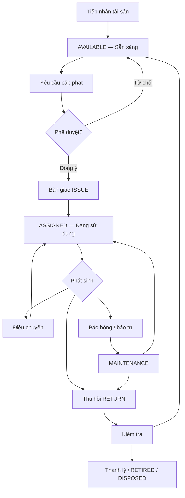
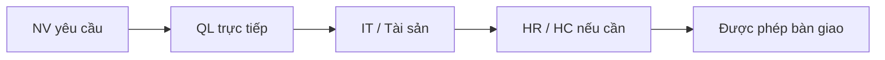
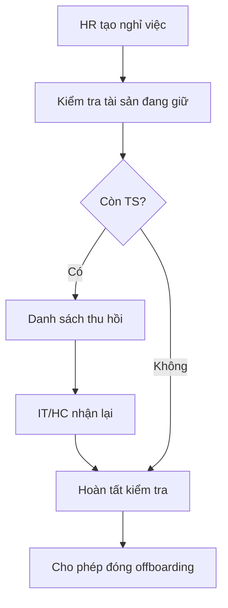

# Đặc tả phân hệ Quản lý Tài sản (SMARTHRM)

> **Trạng thái:** Spec OPEN · Code **v1 mỏng** (Type · Inventory · Ticket ISSUE/RETURN)  
> **Liên quan:** `HDSD.md` Chương 16 · `plan.md` D2 · `plan_v2.md`  
> **Stack:** HrmApi `api/v1/asset*` · HrmAdmin `/asset/*` · Mobile: **chưa có**  
> Cập nhật rà soát source: **2026-08-19**

---

## Mục lục

1. [Mục tiêu](#1-mục-tiêu)
2. [Phạm vi & nguyên tắc thiết kế](#2-phạm-vi--nguyên-tắc-thiết-kế)
3. [Luồng tổng thể](#3-luồng-tổng-thể)
4. [Đối tượng tham gia](#4-đối-tượng-tham-gia)
5. [Luồng nghiệp vụ chi tiết](#5-luồng-nghiệp-vụ-chi-tiết)
6. [Trạng thái tài sản](#6-trạng-thái-tài-sản)
7. [Mô hình dữ liệu đề xuất](#7-mô-hình-dữ-liệu-đề-xuất)
8. [Quy tắc nghiệp vụ](#8-quy-tắc-nghiệp-vụ)
9. [Phân quyền](#9-phân-quyền)
10. [Thông báo & báo cáo](#10-thông-báo--báo-cáo)
11. [Phạm vi MVP / mở rộng](#11-phạm-vi-mvp--mở-rộng)
12. [Tiêu chí nghiệm thu](#12-tiêu-chí-nghiệm-thu)
13. [Rà soát chuẩn doanh nghiệp — cần chỉnh gì](#13-rà-soát-chuẩn-doanh-nghiệp--cần-chỉnh-gì)
14. [Rà soát source & backlog hoàn thành luồng](#14-rà-soát-source--backlog-hoàn-thành-luồng)

---

## 1. Mục tiêu

Theo dõi **vòng đời tài sản cấp cho nhân viên** (laptop, màn hình, điện thoại, thẻ ra vào, bàn ghế, thiết bị chuyên dụng) gắn với hồ sơ HRM.

| Mục tiêu | Ý nghĩa vận hành |
|---|---|
| Biết doanh nghiệp có tài sản gì, ở đâu | Kho + chi nhánh + trạng thái |
| Biết ai đang giữ tài sản nào | Bàn giao theo **giao dịch**, không ghi đè `employeeId` |
| Kiểm soát cấp phát / điều chuyển / thu hồi | Có phê duyệt theo chính sách |
| Theo dõi bảo hành, bảo trì, mất, thanh lý | Trạng thái + lịch sử + chi phí |
| Gate nghỉ việc | Không đóng offboarding khi còn tài sản chưa trả (trừ ngoại lệ có lý do) |
| Audit đầy đủ | Ai làm, khi nào, chứng từ |

---

## 2. Phạm vi & nguyên tắc thiết kế

### 2.1 Trong phạm vi HRM

- Danh mục loại · hồ sơ tài sản · yêu cầu · duyệt · bàn giao · thu hồi · điều chuyển · bảo trì cơ bản · mất · thanh lý · tab NV · báo cáo · tích hợp nghỉ việc.

### 2.2 Ngoài phạm vi (ERP / kế toán — phase sau)

- Sổ cái khấu hao chuẩn VAS/IFRS đầy đủ, PO mua hàng, kho NVL sản xuất, barcode WMS phức tạp.

### 2.3 Nguyên tắc bắt buộc (chuẩn DN)

1. **Mỗi lần giao/trả/điều chuyển = 1 giao dịch** (assignment / ticket) — không chỉ update field người giữ.
2. **Tại một thời điểm, một tài sản (serialized) chỉ có tối đa 1 lượt bàn giao hiệu lực.**
3. **Không hard-delete** tài sản đã phát sinh giao dịch → soft-delete / trạng thái cuối vòng đời.
4. **Serial + Code unique** trong phạm vi công ty (hoặc toàn hệ theo chính sách).
5. **Chuyển trạng thái có ma trận hợp lệ** (VD: `MAINTENANCE` không ISSUE).
6. **DataScope** theo Company / Branch / Dept (giống module HR khác).

---

## 3. Luồng tổng thể



---

## 4. Đối tượng tham gia

| Đối tượng | Trách nhiệm |
|---|---|
| Nhân viên | Nhận / xác nhận bàn giao, báo hỏng, trả tài sản |
| Quản lý trực tiếp | Xác nhận nhu cầu cấp phát / điều chuyển |
| HR | Gắn hồ sơ NV · gate nghỉ việc |
| IT / Hành chính / Tài sản | Nhập kho, bàn giao, thu hồi, bảo trì |
| Người phê duyệt | Duyệt cấp phát, mất, thanh lý (theo giá trị / loại) |
| Hệ thống | Validate, thông báo, ActionLog |

DN nhỏ: một người có thể kiêm nhiều vai trò (RBAC + DataScope).

---

## 5. Luồng nghiệp vụ chi tiết

### 5.1 Khai báo loại tài sản (`AssetType`)

Danh mục trước khi nhập tài sản cụ thể: Laptop, màn hình, điện thoại, thẻ NV, bàn ghế, thiết bị mạng…

**Cấu hình đề xuất trên loại:**

| Thuộc tính | Mục đích |
|---|---|
| Bắt buộc serial | Thiết bị giá trị cao |
| Bảo hành / chu kỳ bảo trì mặc định | Cảnh báo |
| Cần phê duyệt khi cấp phát | Policy |
| Cấp cá nhân / phòng / vị trí | Phân bổ |
| Max số lượng / NV theo loại | Chống cấp trùng |
| Đơn vị chịu trách nhiệm | IT vs HC |

### 5.2 Tiếp nhận tài sản (Inventory)

Nhập: mã, tên, loại, serial, NSX/model, ngày/giá mua, NCC, bảo hành, CN/kho/vị trí, tình trạng, chứng từ.

Hai mô hình:

1. **Serialized** (khuyến nghị HRM): mỗi máy một mã + serial — truy vết trách nhiệm.
2. **Số lượng (consumable/bulk):** chuột, văn phòng phẩm — phase sau nếu cần.

Sau kiểm tra → **`AVAILABLE`**.

### 5.3 Yêu cầu cấp phát

Người tạo: NV · QL · HR (onboarding) · IT (thay thế).

Thông tin: NV nhận, loại TS, mục đích, ngày cần, hạn trả dự kiến, QL, đính kèm.

Vòng đời yêu cầu:

```text
DRAFT → PENDING_APPROVAL → APPROVED | REJECTED → FULFILLED (đã bàn giao)
```

### 5.4 Phê duyệt



Có thể rút gọn theo loại/giá trị. Trước duyệt, hệ thống kiểm tra:

- NV còn làm việc
- Đã có đủ số lượng loại này chưa (policy)
- Còn tồn `AVAILABLE` phù hợp
- Không conflict với tài sản đang `RESERVED` / `ASSIGNED`

### 5.5 Bàn giao (ISSUE)

Chọn tài sản `AVAILABLE` (hoặc `RESERVED` cho yêu cầu) → phiếu bàn giao:

- Người giao / nhận · tài sản · serial · ngày · tình trạng lúc giao · phụ kiện · hạn trả · ảnh/biên bản · xác nhận 2 bên

**Hoàn tất:**

- Asset → `ASSIGNED`
- Hồ sơ NV hiển thị tài sản đang giữ
- Đóng lượt assignment mở (giao dịch)
- Yêu cầu → `FULFILLED`

### 5.6 Theo dõi khi đang dùng

Tab **Tài sản** trên hồ sơ NV + Mobile “tài sản của tôi”:

- Đang giữ · ngày nhận · hạn trả · lịch sử · yêu cầu sửa

Cảnh báo: hết bảo hành · đến hạn bảo trì/kiểm kê · quá hạn trả · NV sắp nghỉ còn giữ TS.

### 5.7 Báo hỏng / bảo trì

NV tạo ticket trên tài sản đang giữ → IT xử lý tại chỗ hoặc thu thiết bị → sửa / bảo hành → bàn giao lại hoặc đề nghị thanh lý. Có thể cấp máy thay thế bằng phiếu ISSUE riêng. Lưu chi phí + thời gian xử lý.

### 5.8 Điều chuyển

NV A → NV B / đổi CN / đổi phòng:

1. Yêu cầu + duyệt  
2. A xác nhận trả  
3. IT kiểm tra  
4. B xác nhận nhận  
5. Đóng assignment cũ · mở assignment mới  

**Không** đổi thẳng người giữ trên master.

### 5.9 Thu hồi (RETURN)

Khi nghỉ việc, đổi thiết bị, hết hạn dùng, cần sửa…

Phiếu ghi tình trạng lúc trả, phụ kiện thiếu, hư hỏng → sau kiểm tra: `AVAILABLE` | `PENDING_INSPECTION` | `MAINTENANCE` | `DAMAGED` | `PENDING_DISPOSAL`.

### 5.10 Tích hợp nghỉ việc (offboarding)



Rule: **block** đóng nghỉ việc nếu còn assignment mở — ngoại lệ cần quyền + lý do (ActionLog).

### 5.11 Mất tài sản

Báo cáo → xác minh → kết luận trách nhiệm → status **`LOST`** → không cấp lại.

### 5.12 Thanh lý

```text
Đề nghị → Thẩm định → Duyệt → Thực hiện → DISPOSED / RETIRED
```

Giữ bản ghi (không xóa) để audit / báo cáo.

---

## 6. Trạng thái tài sản

### 6.1 Ma trận đề xuất (chuẩn DN)

| Mã | Tên | Ý nghĩa |
|---|---|---|
| `DRAFT` | Nháp | Mới tạo, chưa đưa vào kho vận hành |
| `AVAILABLE` | Sẵn sàng | Có thể cấp phát |
| `RESERVED` | Giữ chỗ | Đã gắn yêu cầu APPROVED |
| `ASSIGNED` | Đang sử dụng | Có assignment mở |
| `IN_TRANSFER` | Đang điều chuyển | Transient |
| `MAINTENANCE` | Đang bảo trì | *(code hiện tại: `MAINTENANCE`)* |
| `PENDING_INSPECTION` | Chờ kiểm tra | Sau thu hồi |
| `DAMAGED` | Hỏng | Không dùng bình thường |
| `LOST` | Đã mất | |
| `PENDING_DISPOSAL` | Chờ thanh lý | |
| `DISPOSED` | Đã thanh lý | |
| `RETIRED` | Ngừng sử dụng | |

### 6.2 Đang có trong code (v1)

| Mã API | Ghi chú |
|---|---|
| `AVAILABLE` | ✅ |
| `ASSIGNED` | ✅ |
| `MAINTENANCE` | ✅ enum — **chưa có luồng bảo trì** |
| `RETIRED` | ✅ set tay — **chưa luồng thanh lý** |

---

## 7. Mô hình dữ liệu đề xuất

### 7.1 Quan hệ

- 1 NV ↔ nhiều assignment theo thời gian  
- 1 Asset ↔ nhiều assignment; **≤ 1 open** tại một thời điểm (serialized)  
- 1 Request ↔ nhiều bước duyệt  
- Asset ↔ nhiều maintenance / inventory-count / transfer  

### 7.2 Entity đề xuất (target)

| Entity | Vai trò |
|---|---|
| `AssetType` | Danh mục + policy |
| `Asset` | Master inventory |
| `AssetAssignment` | Lượt bàn giao đang/đã đóng (lịch sử) |
| `AssetRequest` | Yêu cầu cấp phát |
| `AssetTicket` / WorkOrder | ISSUE/RETURN/REPAIR/TRANSFER/LOSS/DISPOSAL |
| `AssetMaintenance` | Chi phí / thời gian sửa |
| `AssetAttachment` | Ảnh, biên bản, hóa đơn |

### 7.3 Đang có trong code

| Entity | Fields chính |
|---|---|
| `AssetTypeEntity` | Code, Name, CompanyId?, Description, IsActive |
| `AssetEntity` | Code, Name, AssetTypeId, CompanyId, BranchId?, Serial?, PurchaseDate/Cost, Status, Note |
| `AssetTicketEntity` | Code, AssetId, EmployeeId, CompanyId, TicketType ISSUE\|RETURN, Status DRAFT\|DONE\|CANCELLED, TicketAt, Note |

---

## 8. Quy tắc nghiệp vụ

- [ ] Code + Serial unique (trong Company)
- [ ] Chỉ ISSUE khi `AVAILABLE` (hoặc `RESERVED` đúng request)
- [ ] Không ISSUE cho NV đã nghỉ / không active
- [ ] Không xóa cứng asset đã có ticket
- [ ] Ticket DONE không sửa trực tiếp — tạo nghiệp vụ điều chỉnh
- [ ] Mọi duyệt / đổi status → ActionLog
- [ ] RETURN không xóa lịch sử assignment
- [ ] Tách quyền: đề nghị / duyệt / bàn giao
- [ ] Offboarding gate tài sản
- [ ] `MAINTENANCE` / `LOST` / `DISPOSED` không ISSUE
- [ ] Ngoại lệ: user + lý do bắt buộc

---

## 9. Phân quyền

### 9.1 Ma trận nghiệp vụ (đề xuất)

| Quyền | NV | QL | IT/TS | HR | Admin |
|---|:---:|:---:|:---:|:---:|:---:|
| Xem TS của mình | ✓ | ✓ | ✓ | ✓ | ✓ |
| Tạo yêu cầu cấp phát | ✓ | ✓ | ✓ | ✓ | ✓ |
| Duyệt yêu cầu cấp dưới | | ✓ | tùy | tùy | ✓ |
| CRUD hồ sơ TS | | | ✓ | tùy | ✓ |
| Bàn giao / thu hồi | | | ✓ | tùy | ✓ |
| Báo hỏng | ✓ | ✓ | ✓ | ✓ | ✓ |
| Xử lý bảo trì | | | ✓ | | ✓ |
| Báo cáo toàn Cty | | scope | ✓ | ✓ | ✓ |
| Thanh lý | | | theo quyền | theo quyền | ✓ |

Kết hợp **DataScope** Company / Branch / Dept / Own.

### 9.2 Permission codes hiện có (API)

| Code | Ghi chú |
|---|---|
| `ASSET_VIEW` / `ASSET_MANAGE` | Ticket API |
| `ASSET_INVENTORY_VIEW/CREATE/UPDATE/MANAGE` | Type + Inventory |
| `ASSET_INVENTORY_IMPORT_EXCEL` / `EXPORT_EXCEL` | **Có code — chưa API** |

Admin còn `ASSET_TYPE_*` / `ASSET_TICKET_*` **không đồng bộ** catalog API → cần thống nhất (§14).

---

## 10. Thông báo & báo cáo

**Thông báo:** yêu cầu chờ duyệt · duyệt/từ chối · chờ bàn giao/thu hồi · chưa xác nhận nhận · hết BH / đến hạn BT · quá hạn trả · NV nghỉ còn giữ TS · kết quả bảo trì.

**Báo cáo:** tồn theo loại/status · đang cấp · chưa cấp · theo CN/PB · sắp hết BH · hỏng/mất/chờ TL · lịch sử 1 TS · lịch sử 1 NV · chi phí sửa · NV nghỉ chưa trả.

---

## 11. Phạm vi MVP / mở rộng

### 11.1 MVP nghiệp vụ (target hoàn chỉnh)

1. Danh mục + hồ sơ tài sản (đủ field DN)  
2. Yêu cầu cấp phát + phê duyệt  
3. Bàn giao + xác nhận nhận  
4. Tab tài sản trên hồ sơ NV  
5. Thu hồi  
6. Điều chuyển  
7. Báo hỏng / bảo trì cơ bản  
8. Gate nghỉ việc  
9. Lịch sử + báo cáo cơ bản  
10. ActionLog + RBAC/DataScope  

### 11.2 Mở rộng (post-MVP)

QR/barcode · kiểm kê định kỳ · nhắc BH/BT · khấu hao · mua hàng/kế toán · ngân sách PB · e-Sign bàn giao · cấp theo Position · multi-kho · dashboard chi phí · Mobile · FCM.

---

## 12. Tiêu chí nghiệm thu

- [ ] Tạo / tra cứu hồ sơ từng tài sản  
- [ ] Không cấp 1 TS serialized cho 2 người cùng lúc  
- [ ] Biết ai giữ + từ khi nào (assignment history)  
- [ ] Tạo → duyệt → bàn giao → điều chuyển → thu hồi  
- [ ] Đổi người giữ không mất lịch sử  
- [ ] Quyền / scope đúng  
- [ ] Offboarding phát hiện TS chưa trả  
- [ ] Status transition hợp lệ  
- [ ] ActionLog thao tác quan trọng  
- [ ] Báo cáo khớp giao dịch  

---

## 13. Rà soát chuẩn doanh nghiệp — cần chỉnh gì

Spec gốc **đúng hướng vòng đời**. Để “chuẩn DN / audit”, nên chỉnh / làm rõ:

| # | Vấn đề | Khuyến nghị |
|---|---|---|
| 1 | Trạng thái quá nhiều nếu làm hết một lần | **Phase:** v1 giữ 4 status code; mở rộng enum khi có entity tương ứng (`RESERVED`, `LOST`, `DISPOSED`…) |
| 2 | Ticket ISSUE/RETURN ≠ assignment history | Tách **`AssetAssignment`** (open/closed) khỏi ticket vận hành; ticket là nghiệp vụ, assignment là sổ đang giữ |
| 3 | Thiếu xác nhận 2 bên / e-Sign | MVP: checkbox xác nhận + timestamp; P2: e-Sign |
| 4 | Thiếu `CompanyId` bắt buộc + DataScope | Mọi query asset filter company/branch như Employee |
| 5 | Consumable vs serialized | MVP **chỉ serialized**; bulk quantity = phase sau |
| 6 | Khấu hao trong HRM | Để post-MVP hoặc export sang kế toán — tránh làm nửa vời VAS |
| 7 | Duyệt đa cấp | Tái sử dụng **Workflow Engine** (`/workflow`) cho AssetRequest — đừng hardcode 3 bước |
| 8 | Offboarding | Hook vào lifecycle `RESIGNED` / transfer movement — bắt buộc trước commercial |
| 9 | Giá trị / ngưỡng duyệt | Field `PurchaseCost` + rule theo DayOffConfig-style trên AssetType |
| 10 | Chứng từ | Attachment URL (reuse upload Cloudinary/S3) trên asset & ticket |

**Kết luận đánh giá plan:** ổn làm **roadmap sản phẩm**; chưa đủ làm **DoD v1 hiện tại**. Cần backlog §14 để khép luồng enterprise tối thiểu (MVP §11.1).

---

## 14. Rà soát source & backlog hoàn thành luồng

### 14.1 Hiện trạng code (2026-08-19)

| Lớp | Có | Chưa |
|---|---|---|
| **Domain** | `AssetType` · `Asset` · `AssetTicket` (ISSUE/RETURN) | Assignment · Request · Maintenance · Loss · Disposal · Attachment |
| **Status asset** | AVAILABLE / ASSIGNED / MAINTENANCE / RETIRED | RESERVED · LOST · DISPOSED · IN_TRANSFER · … |
| **Ticket status API** | `DRAFT` · `DONE` · `CANCELLED` | — |
| **Ticket status Admin enum** | `NEW` · `WAIT_APPROVAL` · `APPROVED`… | **Lệch API** → nút Complete/Edit theo `NEW` **không khớp** `DRAFT` |
| **API** | `api/v1/asset-type` · `asset` · `asset-ticket` (+ complete) | Import/Export Excel · my-assets · reports · approve request |
| **Admin** | `/asset/type` · `/inventory` · `/ticket` | Tab TS trên Employee · dashboard · workflow UI |
| **Mobile** | — | My assets · báo hỏng · xác nhận nhận |
| **Permission** | `ASSET_*` / `ASSET_INVENTORY_*` | Đồng bộ `ASSET_TYPE_*` / `ASSET_TICKET_*` Admin↔API; Excel chưa wire |
| **HDSD** | Chương 16 (rất ngắn) | Bổ sung field, quyền, ops chi tiết |
| **Bug/risk v1** | ISSUE có thể gán status khi tạo dù DRAFT; xóa ticket không revert status; serial không unique; không chặn ISSUE khi ≠ AVAILABLE | Fix trong P0 |

### 14.2 Mapping spec → code

| Hạng mục spec | Code | Ghi chú |
|---|---|---|
| AssetType CRUD | ✅ | Thiếu policy fields (serial required, max/NV…) |
| Inventory CRUD | ✅ cơ bản | Thiếu warranty, vendor, location/kho, model, attachments |
| Yêu cầu cấp phát + duyệt | ❌ | Chỉ có ticket ISSUE thủ công |
| Bàn giao / thu hồi | 🟡 | Ticket ISSUE/RETURN + complete — chưa assignment history chuẩn |
| Điều chuyển | ❌ | |
| Bảo trì | 🟡 | Có status MAINTENANCE — không có ticket/WO |
| Mất / thanh lý | ❌ | RETIRED set tay |
| Tab hồ sơ NV | ❌ | |
| Offboarding gate | ❌ | |
| Báo cáo / thông báo | ❌ | |
| Mobile | ❌ | |

### 14.3 Backlog triển khai (làm tuần tự)

#### P0 — Vá v1 cho dùng được nội bộ (1–3 ngày)

- [x] **Đồng bộ enum ticket status** Admin ↔ API (`DRAFT`/`DONE`/`CANCELLED` hoặc migrate API sang flow duyệt)
- [x] **Chặn ISSUE** nếu asset không `AVAILABLE`
- [x] **Unique** `Code` (+ `SerialNumber` khi có) theo `CompanyId`
- [x] ISSUE chỉ đổi `ASSIGNED` khi **Complete** (không gán lúc Draft)
- [x] Xóa/cancel ticket: **revert** status asset nếu cần
- [x] Thống nhất permission: map Admin `ASSET_TICKET_*` / `ASSET_TYPE_*` → API codes (hoặc thêm vào `PermissionCodes` + reseed)
- [x] Wire **Import/Export Excel** hoặc bỏ permission chết
- [x] Cập nhật **HDSD Chương 16** ops thật (menu, quyền, luồng ISSUE/RETURN)

#### P1 — Khép MVP doanh nghiệp (ưu tiên)

- [x] Entity **`AssetAssignment`** (EmployeeId, AssetId, IssuedAt, ReturnedAt, IssuedBy, condition…); ticket chỉ tạo/đóng assignment
- [ ] Entity **`AssetRequest`** + trạng thái duyệt; tích hợp **Workflow Engine** hoặc approve 1 cấp Manager
- [x] Mở rộng **AssetType** policy + **Asset** (warrantyEnd, vendor, model, location, attachments)
- [x] Tab **Tài sản** trên Employee detail (Admin) + API `employee/{id}/assets`
- [x] **Offboarding gate**: block resign/finalize nếu còn assignment mở
- [x] Ticket type thêm: `REPAIR` · `TRANSFER` (tối thiểu) · cập nhật status `MAINTENANCE` / `IN_TRANSFER`
- [x] ActionLog cho create/complete/cancel ticket & đổi status asset
- [x] DataScope filter list asset/ticket theo company/branch
- [x] Báo cáo cơ bản Admin: tồn theo status · đang cấp theo NV · sắp hết BH (nếu có field)

#### P2 — Mobile & vận hành sâu

- [ ] Mobile: **Tài sản của tôi** · xác nhận nhận · báo hỏng · lịch sử
- [ ] Thông báo (FCM khi có infra `plan_v2`) duyệt / chờ bàn giao / quá hạn trả
- [ ] Loss + Disposal flow + status `LOST` / `DISPOSED`
- [ ] Kiểm kê định kỳ / QR
- [ ] e-Sign biên bản bàn giao
- [ ] Dashboard chi phí bảo trì

#### P3 — ERP-adjacent

- [ ] Khấu hao / giá trị còn lại  
- [ ] Tích hợp mua hàng · kế toán  
- [ ] Multi-warehouse WMS  

### 14.4 Thứ tự đề xuất

```text
P0  Vá enum + rule ISSUE/AVAILABLE + unique + permission sync + HDSD
P1  Assignment + Request/Approve + Employee tab + Offboarding gate + Repair/Transfer
P2  Mobile my-assets + Loss/Disposal + alerts
P3  Depreciation / ERP
```

### 14.5 Definition of Done — “hoàn thành luồng quản lý tài sản” (MVP)

Phân hệ được coi **hoàn thành luồng core** khi checklist §12 + các mục **P0 + P1** ở trên đều `[x]`, và smoke:

1. Tạo Type → tạo Asset AVAILABLE  
2. (Request duyệt nếu có) → ISSUE Complete → Asset ASSIGNED · thấy trên hồ sơ NV  
3. RETURN Complete → AVAILABLE · lịch sử còn người cũ  
4. NV nghỉ còn TS → hệ thống chặn / liệt kê thu hồi  
5. User NV không thấy kho toàn Cty; IT thấy đúng DataScope  

---

## 15. Kết luận

Quản lý tài sản trong HRM là **chuỗi giao dịch gắn nhân sự**, không chỉ danh mục thiết bị. Spec này định hướng đúng chuẩn DN; **code v1 mới phủ Type · Inventory · Ticket ISSUE/RETURN**.

Ưu tiên: **P0 vá lệch Admin/API** → **P1 Assignment + Request + Offboarding + tab NV** → Mobile/P2.

---

*File này là nguồn sự thật cho phân hệ Tài sản. Khi implement xong từng mục §14, đánh `[x]` và cập nhật `HDSD.md` Chương 16.*
